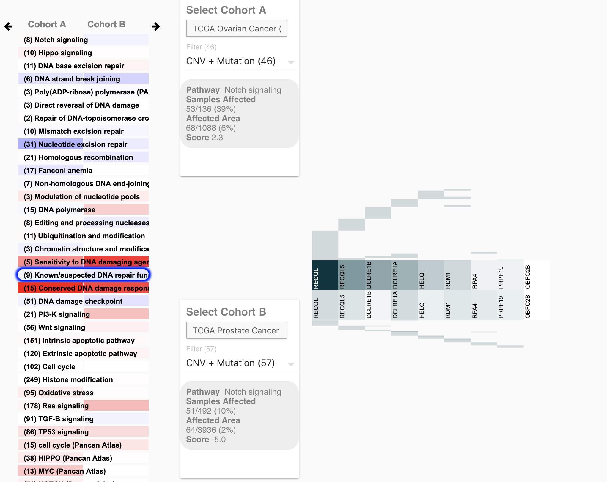

# GeneSet Viewer

GeneSet view ([Source](https://github.com/ucscXena/XenaGoWidget)) cohort comparison tool:

<https://xenageneset.berkeleybop.io/xena/>

is part of the [Xena HeatMap suite](https://xenabrowser.net/heatmap/).

## About

Allows comparison individual gene sets and genes across two cancer cohorts. 

[TODO:]:<>(### Explanation of vertical gene set to include geneset data)

[TODO:]:<>(### Explanation of individual gene view)

[TODO]:<>(## Features)
[TODO]:<>(### Gene Search )
[TODO]:<>(### Pathway Editor)
[TODO]:<>(Allows users to edit custom gene sets to explore.  )
[TODO]:<>(By default we provide cohort comparison of some cohorts, but not others.)
[TODO]:<>(## Configuration)
[TODO]:<>(- Color )
[TODO]:<>(- Show reciprocal geneset )
