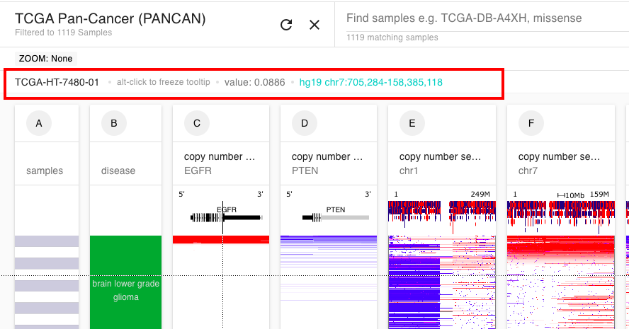

# How do I interact with the tooltip?

When you are in the Xena Visual Spreadsheet, hovering the mouse over any data on the screen will trigger a tooltip to show up at the top of the view.&#x20;

To **freeze** the tooltip, you need to "Alt-click", i.e. hold on the ALT key on your computer and at the same time click the left mouse button.

To **unfreeze** the tooltip, click on the close (X) icon.

This can be helpful if you want to click on the link to take you to the UCSC Genome Browser, where you can view more information about those genomic coordinates.&#x20;

