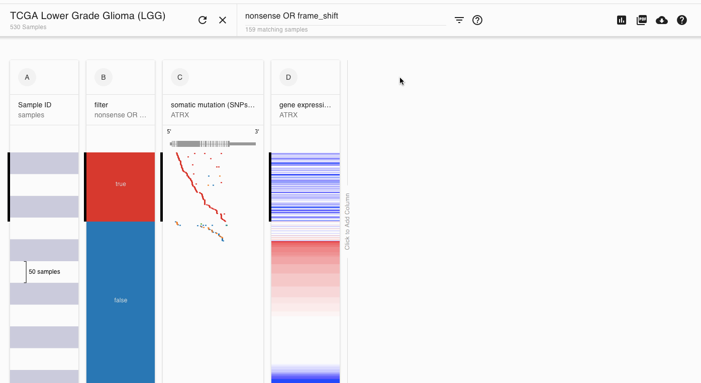

# How do I compare gene expression between subgroups?

First [make subgroups](https://ucsc-xena.gitbook.io/project/how-to-pages-1/how-do-i-make-subgroups). Next, make sure that the gene or genes that you want to use in the comparison are on screen. Finally, click on the charts icon in the top right and select your subgroups as the x-axis and the gene or genes you want to compare in the y-axis.

## Example

Below is a demo of this in TCGA Lower Grade Glioma. The subgroups are those samples that have a nonsense or frameshift mutation in ATRX and those that do not. We are comparing gene expression first for ATRX and then for ATRX and TERT.

### [Beginning of video bookmark](https://xenabrowser.net/heatmap/?bookmark=d7c79a54a72523d6e41a4917ed74eaff)

### [End of video bookmark](https://xenabrowser.net/heatmap/?bookmark=2f4f49697161563400832a2453063af4)

