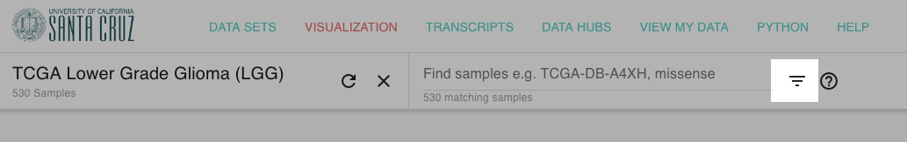

# How do I filter to just one cancer type

Many times users will start with one of the PanCan datasets but need to filter to just one cancer type. 

## Generalized Steps

### 1. Add the phenotype column that details the cancer type

Please see the study specific instructions for which column

### 2. Use the filter functionality to select the cancer type

Using the filter search bar:

Search for the cancer type you are interested in, making sure that it is listed in the phenotype column.

More help can be found at:



### 3. Filter to just those samples

Click the Filter button next to the search bar and select 'Filter'

### 4. Add columns of data you want to see on those samples

Click on 'Click on Add column' to the right of the last column to add more data, such as gene expression, to the view.

## TCGA Pan-Cancer \(PANCAN\) Study Specific Steps/Link

For the TCGA PanCan \(PANCAN\), you will want to add the phenotype column:

> cancer type abbreviation


[Here is a bookmark ](https://xenabrowser.net/heatmap/?bookmark=d34a38000eca5f2bfcf936d5e06066dc)that will take you to the TCGA PanCan \(PANCAN\) Study with that phenotype column already selected.


## GDC TCGA PanCan \(PANCAN\) Study Specific Steps/Link

For the GDC TCGA PanCan \(PANCAN\), you will want to add the phenotype column:

> disease\_type


[Here is a bookmark ](https://xenabrowser.net/heatmap/?bookmark=647fda97e21e3626d17788770855bd3c)that will take you to the GDC TCGA PanCan \(PANCAN\) Study with that phenotype column already selected.


