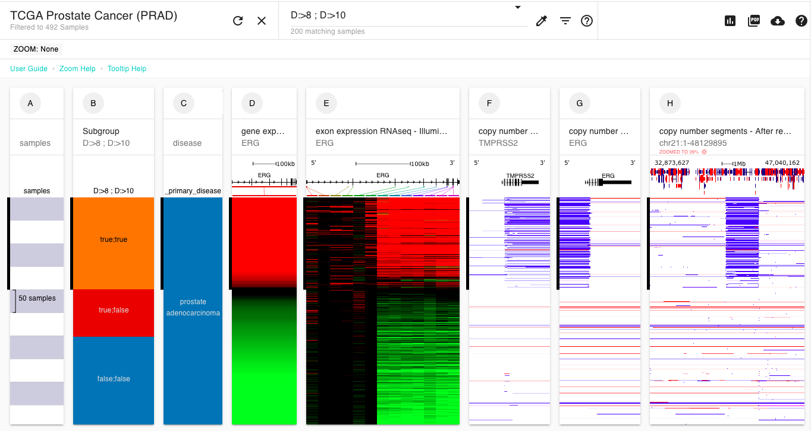

# How do I make more than 2 subgroups?


This page assumes you are familiar with making 2 subgroups. If you are not, please see the ['How do I make subgroups'](how-do-i-make-subgroups.md) help page.


To make more than 2 sample subgroups, enter multiple search terms, such as 'C:>15' into the search box and separate each search term with a ';'.

This can be used to divide a numerical column into multiple subgroups.

## Example

For instance, if you have column C that ranges from 7.3 to 12 and you want to have 3 groups: 7.3 - 9, 9 - 10, and 10 - 12, you would enter:

C:>9 ; C:>10

into the search bar and then choose 'New subgroup column'.

****[**Ending Screenshot**](https://xenabrowser.net/heatmap/?bookmark=325cfbf706d253e29253ea430a4fabd1)****


[See our help on renaming the subgroup labels](https://ucsc-xena.gitbook.io/project/overview-of-features/filter-and-subgrouping#changing-subgroup-labels) from 'true' and 'false' to something more biologically meaningful.

