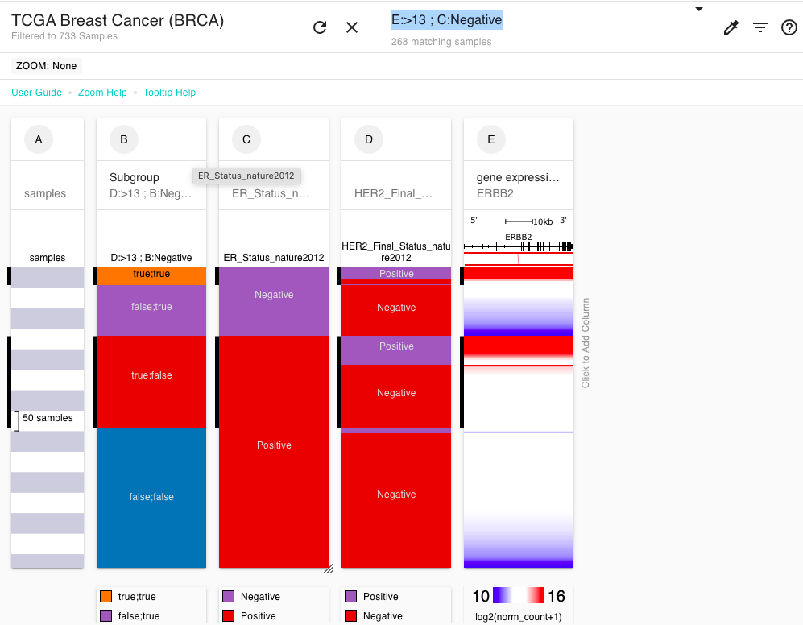
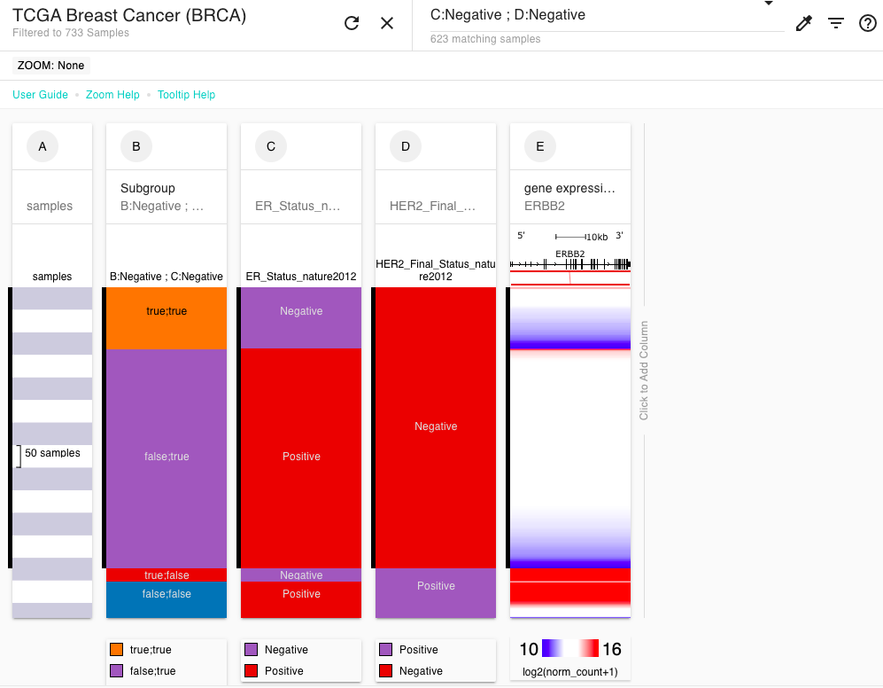

# How do I make more than 2 subgroups?


This page assumes you are familiar with making 2 subgroups. If you are not, please see ['How do I make subgroups'](how-do-i-make-subgroups.md).


To make more than 2 sample subgroups, enter multiple search terms, such as 'C:>15' into the search box. Separate each search term with a ';'.

This can be used for a number of situations:

* To divide a single numerical column into more than 2 subgroups (e.g. geneA high, geneA mid, and geneA low)
* To make subgroups over the expression of two genes such that you get 4 subgroups (e.g. geneA high + geneB high, geneA low + geneB high, geneA high + geneB low, geneA low + geneB low)
* To make subgroups over the expression of a gene and a categorical column (e.g. geneA high + Estrogen Receptor positive, geneA low + Estrogen Receptor positive, geneA high + Estrogen Receptor negative, geneA low + Estrogen Receptor negative)
* To make subgroups over two categorical columns (e.g. Estrogen Receptor positive + HER2 positive, Estrogen Receptor negative + HER2 positive, Estrogen Receptor positive + HER2 negative, Estrogen Receptor negative + HER2 negative)

See below for an example of each.

## Examples

### Dividing a single numerical column into more than 2 subgroups (e.g. geneA high, geneA mid, and geneA low)

In the screenshot below you can see that column D that ranges from 7.3 to 12. If you wanted to have 3 groups: 7.3 - 9, 9 - 10, and 10 - 12, you would enter:

> C:>9 ; C:>10

into the search bar and then choose 'New subgroup column' from the filter/subgroup drop down menu.

[**Ending Screenshot**](https://xenabrowser.net/heatmap/?bookmark=325cfbf706d253e29253ea430a4fabd1)


[See our help on renaming the subgroup labels](https://ucsc-xena.gitbook.io/project/overview-of-features/filter-and-subgrouping#changing-subgroup-labels) from 'true' and 'false' to something more biologically meaningful.


### Making subgroups over the expression of two genes such that you get 4 subgroups (e.g. geneA high + geneB high, geneA low + geneB high, geneA high + geneB low, geneA low + geneB low)

[Click here to see our separate help page for this scenario](how-do-i-make-subgroups-with-4-groups.md)

### Making subgroups over the expression of a gene and a categorical column (e.g. geneA high + Estrogen Receptor positive, geneA low + Estrogen Receptor positive, geneA high + Estrogen Receptor negative, geneA low + Estrogen Receptor negative)

In the screenshot below you can see that column E (ERBB2 gene expression) that ranges from 10 to 16. If you wanted to have 4 groups: ERBB2 > 13 + Estrogen Receptor positive, ERBB2 <= 13 + Estrogen Receptor positive, ERBB2 > 13 + Estrogen Receptor negative, ERBB2 <= 13 + Estrogen Receptor negative), you would enter:

> E:>13 ; C:Negative

into the search bar and then choose 'New subgroup column' from the filter/subgroup drop down menu.

[**Ending screenshot**](https://xenabrowser.net/heatmap/?bookmark=ce392a796505576a74715f6ac94efdb3)


[See our help on renaming the subgroup labels](https://ucsc-xena.gitbook.io/project/overview-of-features/filter-and-subgrouping#changing-subgroup-labels) from 'true' and 'false' to something more biologically meaningful.


### Making subgroups over two categorical columns (e.g. Estrogen Receptor positive + HER2 positive, Estrogen Receptor negative + HER2 positive, Estrogen Receptor positive + HER2 negative, Estrogen Receptor negative + HER2 negative)

In the screenshot below, if you wanted to have 4 groups: Estrogen Receptor positive + HER2 positive, Estrogen Receptor negative + HER2 positive, Estrogen Receptor positive + HER2 negative, Estrogen Receptor negative + HER2 negative you would enter:

> C:Negative ; D:Negative

into the search bar and then choose 'New subgroup column' from the filter/subgroup drop down menu.

[**Ending bookmark**](https://xenabrowser.net/heatmap/?bookmark=9a9f5ef512650adf702bd3b374ced7ba)


[See our help on renaming the subgroup labels](https://ucsc-xena.gitbook.io/project/overview-of-features/filter-and-subgrouping#changing-subgroup-labels) from 'true' and 'false' to something more biologically meaningful.

