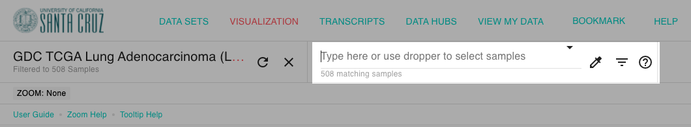

# How do I make subgroups?

You will use the find samples feature \(highlighted below\) to make subgroups:

First, search for all the patient's samples you want in one of your subgroups. Next, click the Filter + Subgroup menu and choose 'New subgroup column'.

This will create a new column will be created with your subgroups. All the patient's samples that matched your search term will be in one subgroup and all the samples that did not match your search term will in the other subgroup. The patient's samples that matched your search term will be labeled as 'true' and those that did not will be labeled as 'false'.

Your new column can be used for a [KM analysis](how-do-i-make-a-km-plot.md) or to [compare gene expression](https://ucsc-xena.gitbook.io/project/how-to-pages-1/how-do-i-compare-gene-expression-between-subgroups).


More information:

* [How to search for samples](../overview-of-features/filter-and-subgrouping/)
* [Recognized search terms for filtering and subgrouping](../overview-of-features/filter-and-subgrouping/#supported-search-terms)


## Example

In this example we are creating two subgroups: those patient's samples that have EGFR aberrations \(either mutations or copy number amplifications\) and those that do not in the TCGA Lung Adenocarcinoma study. 

#### Steps

1. Type **'**\(mis OR infra\) OR C:&gt;0.5'  into the samples search bar. This will select samples that either have a missense or inframe deletion '\(mis OR infra\)', or where copy number variation \(column C\) is greater than 0.5. Note that I arbitrarily choose a cutoff of 0.5.
2. Click the filter menu and select 'New column subgroup'. This will create a new column that has samples that met our search term marked as 'true' \(ie. those that have an _EGFR_ aberration\) and those that did not meet our search term as 'false' \(ie. those that do not have an _EGFR_ aberration\).


For more information see our [Basic Tutorial: Section 2](../tutorials/basic-tutorial-section-2.md), where this example was pulled from.


