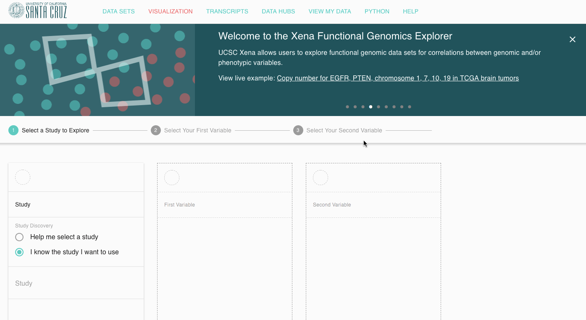

# How do I make subgroups?

Xena uses the search and highlight feature to make subgroups

As you type Xena will search all the data on the screen for your values and then highlight those that match. 

You may need 'AND' or 'OR' to divide your samples. [This help page](http://xena.ucsc.edu/highlight-filter-help/) details a complete list of all the search terms we support. 

After all the samples that you want to put in one subgroup are highlighted, you use the highlight menu to create a new column.

## Example

Below is a demo of this in TCGA Lower Grade Glioma. We are going to create a subgroup of samples that have a nonsense or frameshift mutation in ATRX and another subgroup of those that do not. 

### [Beginning of video bookmark](https://xenabrowser.net/heatmap/)

### [End of video bookmark](https://xenabrowser.net/heatmap/?bookmark=d7c79a54a72523d6e41a4917ed74eaff) 

This new subgroup column can then be used for a KM analysis \(use the column menu\) or to [compare gene expression](https://ucsc-xena.gitbook.io/project/how-to-pages-1/how-do-i-compare-gene-expression-between-subgroups).

