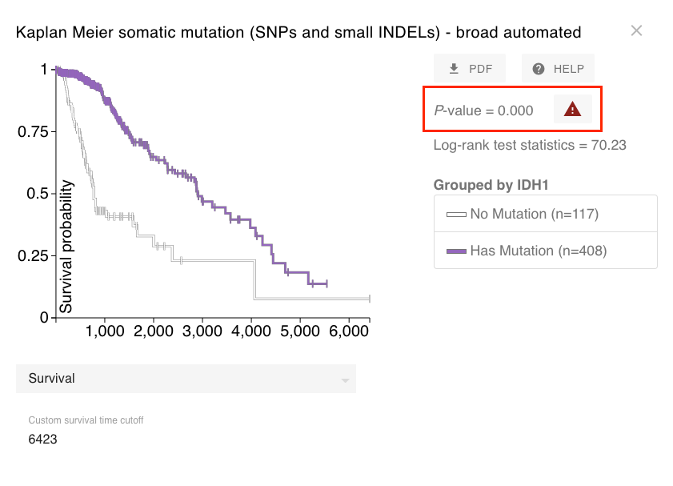
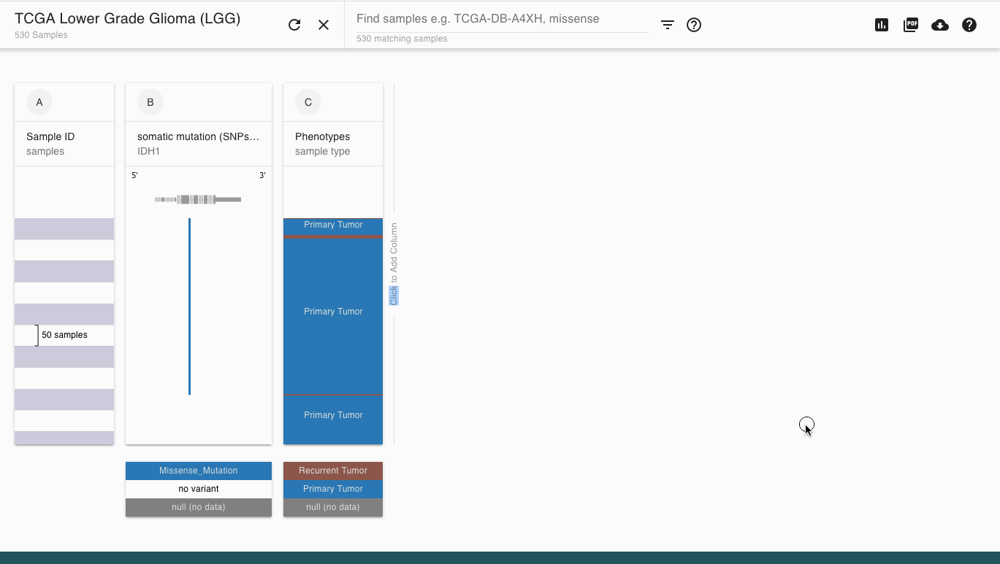

# How do I remove duplicate samples from a KM plot?

If your plot has an '!' icon next to the p-value this means that some patients are in your plot twice. This can happen when A) a patient has both a tumor and normal sample or when a patient has a metastasis that is part of the dataset and/or B) a tumor sample was split into multiple aliquots and then run through the same analysis twice.

This page will guide you on how to remove duplicates due to A. If there are duplicates due to B you will need to [download the data](../overview-of-features/download-data.md), decide how to resolve any inconsistencies between the multiple aliquots and [load it into your own Xena Hub](../local-xena-hub/).

### Example of error icon

****[**Ending Screenshot**](https://xenabrowser.net/heatmap/?bookmark=93a89b4749b93a0288d9c2ea23045fae)****

## Removing duplicates

1. Add the data column of 'sample type' from the Phenotype data


We are adding a column of data that indicates the sample type such as 'Primary Tumor', 'Normal', etc. Note that different datasets may have a different name for this the data.


2\. Filter to only samples that are 'Primary tumor' by typing 'primary' into the filter search box. Next, click the filter icon next to the filter search box and chose 'Filter'. This will filter out all samples that are not primary tumor.


[More help on filtering](../overview-of-features/filter-and-subgrouping/)


3\. Run your KM analysis by clicking the caret menu at the top of the column and choosing 'Kaplan-Meier plot' It will now only have primary tumor samples in it.

## Example

Removing duplicate samples from TCGA Lower Grade Glioma KM analysis

****[**Ending Screenshot**](https://xenabrowser.net/heatmap/?bookmark=a56b47aefabb74042622547395a6b0a0)****

