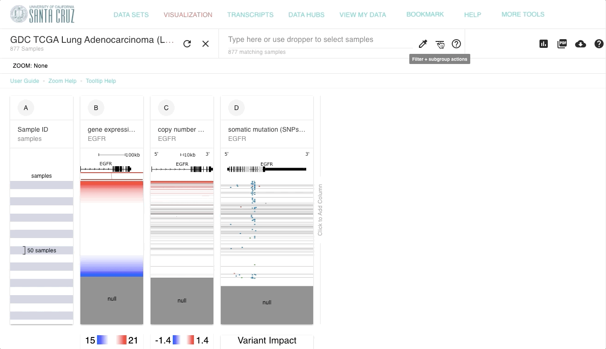

# How do I remove null data (gray lines) from view?

Sometimes not all samples in a dataset have data. This can happen for a variety of reasons, such as a particular patient's sample did not undergo one or more analyses. In this case, we use gray, or 'null' to show that there is no data.&#x20;

To remove null data use the 'Remove samples with nulls' shortcut in the filter menu.

