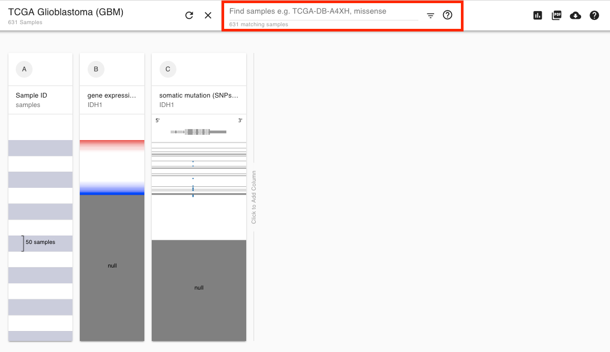
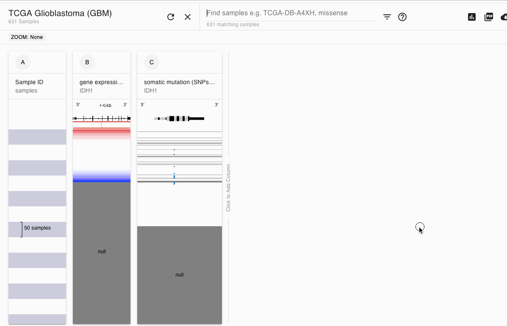

# How do I remove null data \(gray lines\) from view?

## Key Take-Away

To remove all nulls across all columns: type "!=null" in the Find/Search Bar at the top of the screen.

## Example walkthrough

Sometimes not all samples in a dataset have data, like in the case that a particular sample did not undergo gene expression analysis. In this case, we use gray to show that there is no data. This post will show how to remove these samples from view, allowing you to see a clearer picture.

As an example we will use IDH1 expression TCGA GBM. Start by choosing the TCGA GBM cohort. Next, enter IDH1 and choose 'gene expression' and 'somatic mutation'. Next we will type into the highlighting find/search bar:

> !=null

This will highlight all the samples that have data for both columns with black tick marks.

Next click on the filter button \(upside down pyramid next to the question icon and choose 'Filter'\). This will filter down the samples to just the ones you selected. Your screen should now look like below.

Below is a small video demonstrating this.

### [Beginning Bookmark](https://xenabrowser.net/?bookmark=9803241f32984ef123a2fca713e3ea9e)

### [Ending Bookmark](https://xenabrowser.net/?bookmark=eee25fe4eae8408150854adbd99ab97a)

## More information on [supported search terms](../overview-of-features/filter-and-subgrouping.md#supported-search-terms)

