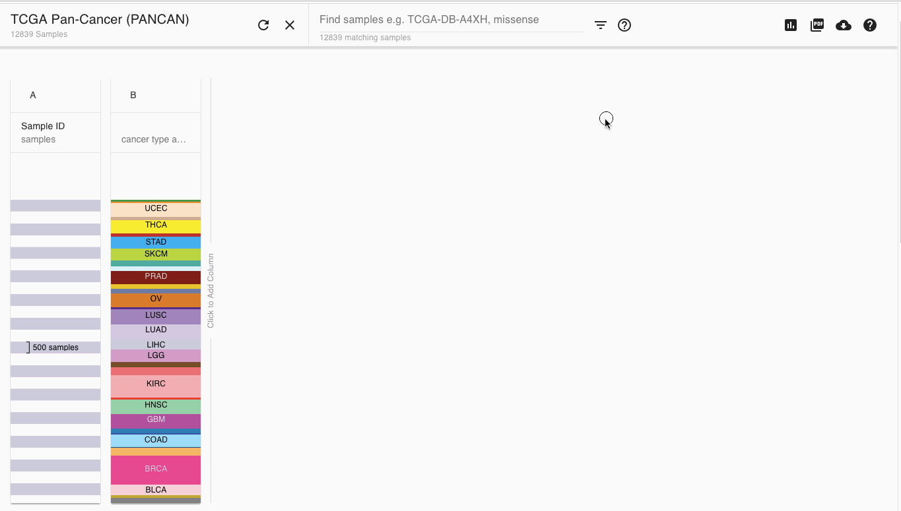

# How do I view multiple types of cancer together?

To view multiple types of cancer side-by-side, such as ovarian and breast together, you will need to start with a Pan-Cancer dataset and then filter down to just the cancer types you want to see. 

There are 2 main Pan-Cancer studies:

* [TCGA PanCan Study](https://xenabrowser.net/datapages/?cohort=TCGA%20Pan-Cancer%20%28PANCAN%29) This contains the latest data from the PanCan Atlas project, including many hand curated datasets. It also contains some legacy TCGA data across all cancer types, including GISTIC 2 CNV estimates and miRNAseq estimates.
* [GDC TCGA PanCan \(PANCAN\) Study](https://xenabrowser.net/datapages/?cohort=GDC%20Pan-Cancer%20%28PANCAN%29) This contains the latest data from the GDC across all cancer types, mapped to hg38

If you do not know which one you wish to use, we recommend starting with the TCGA PanCan Study.

## Generalized Steps

### 1. Add the phenotype column that details the cancer type

Please see the study specific instructions for which column this is.

### 2. Use the filter functionality to select the cancer type

Use the filter search bar to search for the cancer type you are interested in. Be sure to type the term as it shows in the phenotype column you added in step 1.


Separate each cancer type by 'OR'. Example: 'lgg OR gbm'


More help can be found at:



### 3. Filter to just those samples

Click the Filter + Subgroup menu next to the search bar and select 'Keep Samples'

### 4. Add columns of data you want to see on those samples

Click on 'Click on Add column' to the right of the last column to add more data, such as gene expression, to the view.

## For TCGA Pan-Cancer \(PANCAN\) ... 

For the TCGA PanCan \(PANCAN\), you will want to add the phenotype column:

> cancer type abbreviation


[Here is a bookmark ](https://xenabrowser.net/heatmap/?bookmark=d34a38000eca5f2bfcf936d5e06066dc)that will take you to the TCGA PanCan \(PANCAN\) Study with that phenotype column already selected.


## For GDC TCGA PanCan \(PANCAN\) ...

For the GDC TCGA PanCan \(PANCAN\), you will want to add the phenotype column:

> disease\_type


[Here is a bookmark ](https://xenabrowser.net/heatmap/?bookmark=647fda97e21e3626d17788770855bd3c)that will take you to the GDC TCGA PanCan \(PANCAN\) Study with that phenotype column already selected.


## Example

Below is an example for viewing breast and ovarian cancer together for the TCGA PanCan Atlas

### [Beginning of video bookmark](https://xenabrowser.net/heatmap/?bookmark=94d91442ccbf3ad7302857db86e8a3cf)

### [End of video bookmark](https://xenabrowser.net/heatmap/?bookmark=beeee48590a9183ac2944063ba4c1774)

