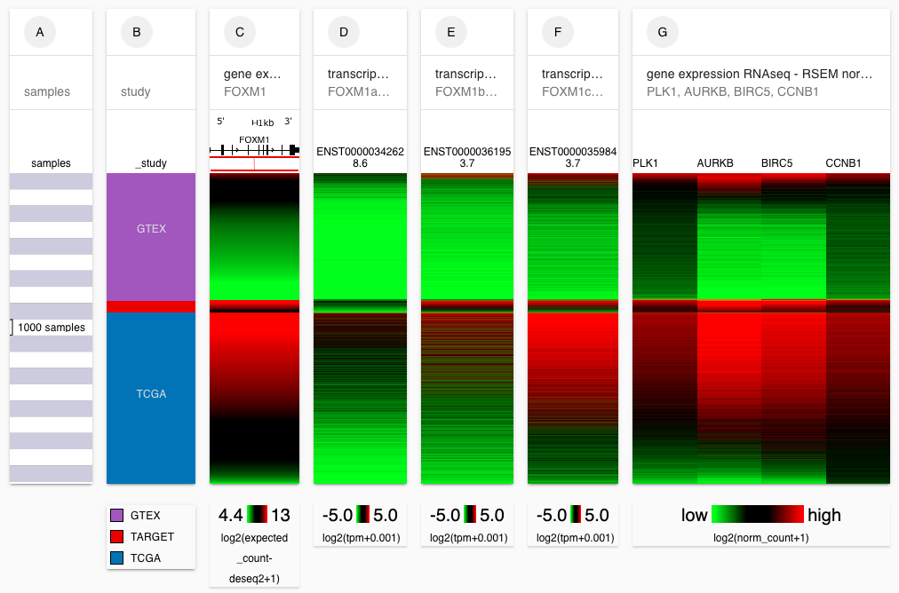
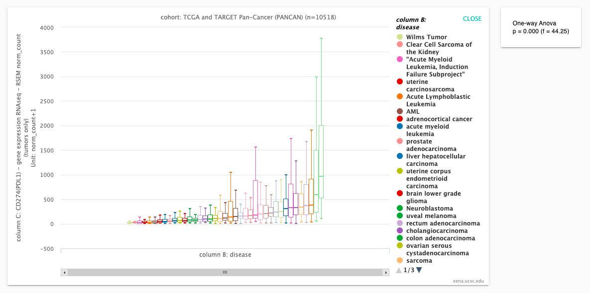
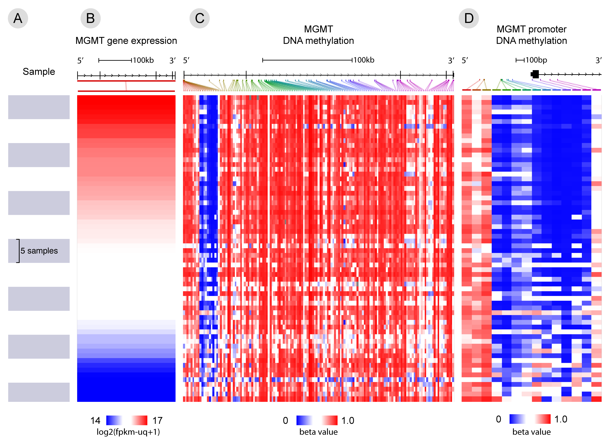
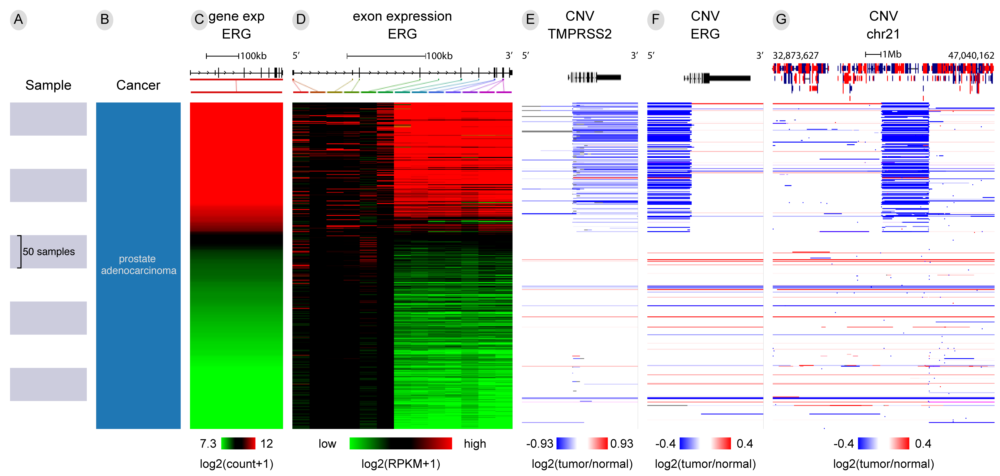
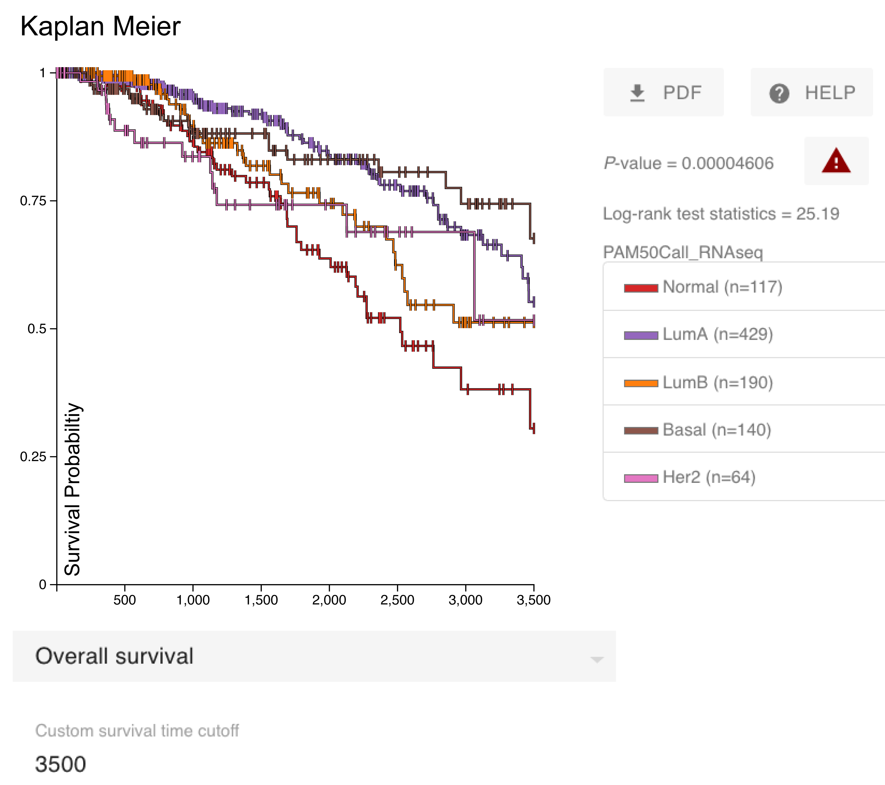
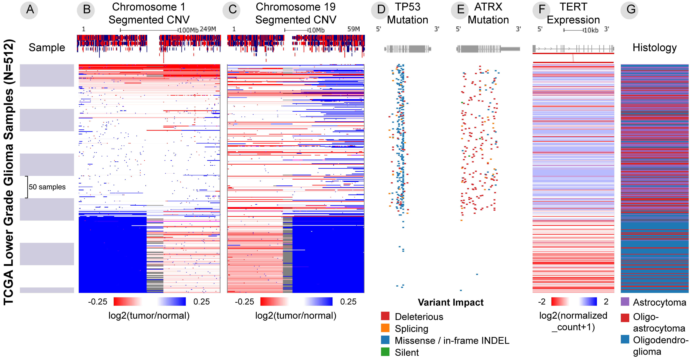
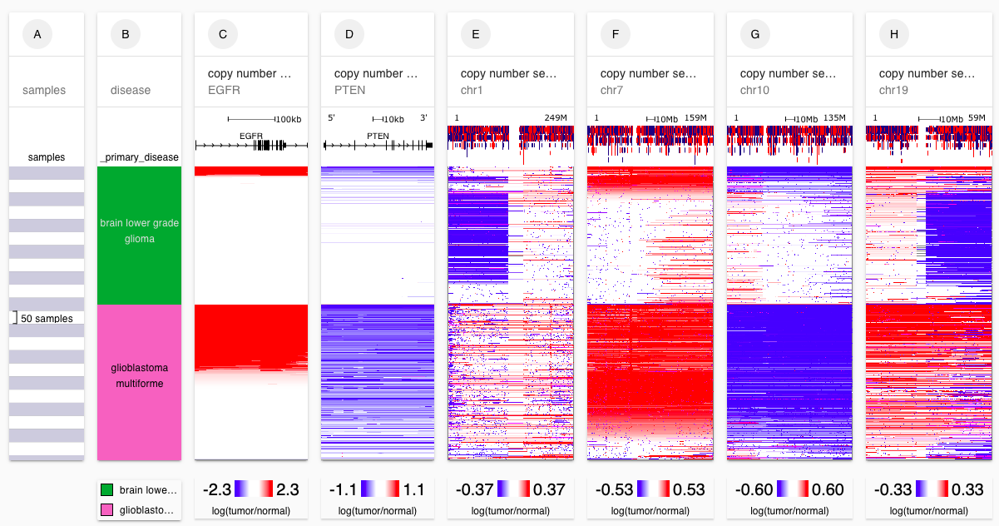
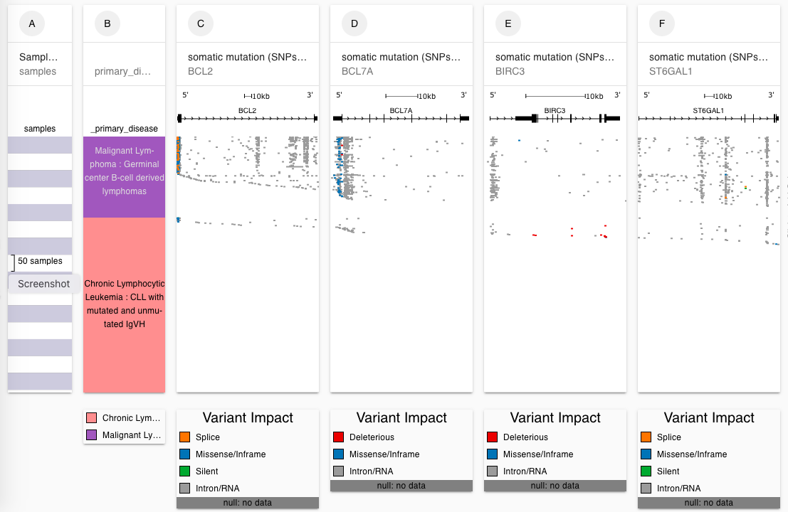
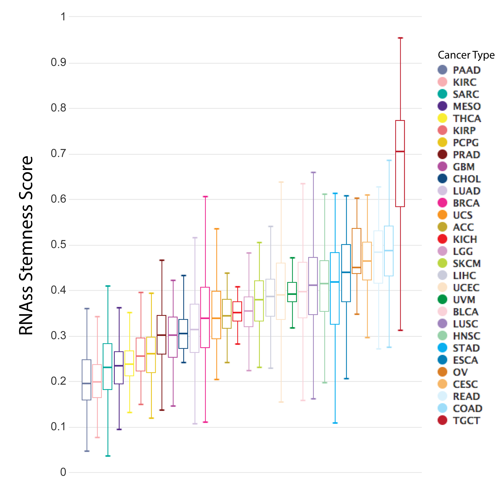

# Live examples

## Workshop cheatsheet/handout



## [FOXM1a, FOXM1b, FOXM1c transcript expression in tumor vs. normal samples](https://xenabrowser.net/heatmap/?bookmark=bc7f3f46b042bcf5c099439c2816ff01)

## [PDL1 and PD1 expression across 39 cancer types in TCGA and TARGET](https://xenabrowser.net/heatmap/?bookmark=3f4b3fa8901f4c24f5f791e036566424)

## [MGMT gene expression ~ promoter DNA methylation in GBM](https://xenabrowser.net/heatmap/?bookmark=2dc4735dd97964b7c2a57afe053a9764)

## [ERG-TMPRSS2 fusion in prostate cancer ](https://xenabrowser.net/heatmap/?bookmark=cd6d8adead7d720fea7df197dc807147)

## [KM plot of breast cancer PAM50 subtypes](https://xenabrowser.net/?bookmark=23e26bfa823e49d241439ae701f267e4)

## [Genetic separation of lower grade gliomas: one characterized by loss of chromosomes 1p & 19q, the other by TP53 & ATRX mutations](https://xenabrowser.net/heatmap/?bookmark=6451afae2ee964475a2eb9c79d46900c)

## [Copy number for EGFR, PTEN, chromosome 1, 7, 10, 19 in TCGA brain tumors](https://xenabrowser.net/heatmap/?bookmark=0f9954a525987445ba7faef1e2081027)

## [Mutation pile-ups in intron enhancers in ICGC lymphoma](https://xenabrowser.net/heatmap/?bookmark=dfc37064d62ea0c0302881c05277b7b3)

## [Stemness scores across TCGA cancer types](https://xenabrowser.net/?bookmark=7deeea053f221ba9fc506be855f353ac)

