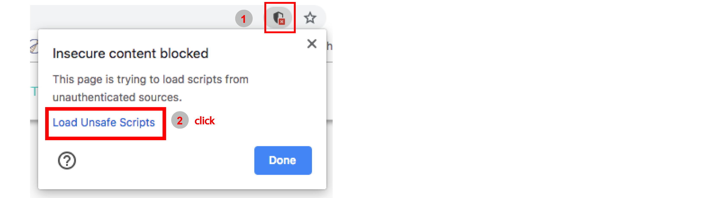

# Hubs for institutions, collaborations, labs, and larger projects

If you are looking to share data on a Xena Hub with a specific group of people. Xena Hubs can be set up on any server or in the cloud. You control who has access to the Xena Hub by controlling who has access to the server on which it is hosted.

To make your data publicly available, simply make the server open to the web.

## Download

First, download the ucsc\_xena\_xxx.tar.gz file to your server, here:

[https://genome-cancer.ucsc.edu/download/public/get-xena/index.html](https://genome-cancer.ucsc.edu/download/public/get-xena/index.html)

The file to download is the one called "**Tar archive, no updater or JRE - recommended for linux server** **developments**". Uncompress and extract the .jar file \(cavm-xxx-standalone.jar\). The current version is 0.25.0.

## Start the hub.

The hub can be started with "java -jar cavm-xxx-standalone.jar". Passing option --help will display usage information.

There are several options you will want to set.

To bind an external interface \(instead of loopback\), use "--host 0.0.0.0".

There are three paths that can be configured: the database file, the log file, and the root directory for data files to be served. These are set by --database, --logfile, and --root. If you don't set these, they will default to paths under ${HOME}/xena.

```text
--database -d default to ${HOME}/xena/database
```

```text
--logfile default to ${HOME}/xena/xena.log
```

```text
--root -r default to ${HOME}/xena/files/
```

## Example start script for an open-access hub

Copy the content below to a file "start\_script"

```text
#!/bin/bash

PORT=7222
LOGFILE=xena/xena7222.log 
DOCROOT=xena/files
DB=xena/myHub

java -jar server.jar -r ${DOCROOT} -d ${DB} --no-gui -p ${PORT} -H 0.0.0.0 --logfile ${LOGFILE} > log 2>&1 &

disown
```

Link server.jar to cavm-x.xx.x-standalone.jar

```text
ln -sf cavm-0.xx.0-standalone.jar server.jar
```

Make "start\_script" executable

```text
chmod u+x start_script
```

Run "./start\_script"

```text
./start_script
```

Your hub is now running on "http:computer-external-ip:7222" and "[https://computer-external-ip:7223](https://computer-external-ip:7223)".

Go [here](https://xenabrowser.net/hub/), add "http:computer-external-ip:7222"

* This will connect your hub to the Xena Browser. Because you try to connect to the hub through http, you will have to clear your browser's \(Chrome, Firefox, etc\) security warning on "load unsafe scripts" to connect.



Alternatively, you can connect your hub through https \([https://computer-external-ip:7223\](https://computer-external-ip:7223\)\) to avoid the browser warning, and you need a certificate. See HTTPS section on --certfile and --keyfile options to start a hub with a certificate.

## Make your data ready

You will need to make your data file ready just like for local Xena hub on your laptop. Please see instructions on [data format specifications](https://ucsc-xena.gitbook.io/project/local-xena-hub/data-format-specifications).

You will also need to make your data's meta-data file \(xxx.json\) ready. Please see [loading data from the command line](loading-data-from-the-command-line.md) for instructions.

## Load data through command line

Once the hub is running, and input files have been placed in the --root directory, a file can be loaded by running the jar a second time, with the -l option, like

```text
ln -sf cavm-x.xx.x-standalone.jar server.jar
```

If your hub is run on the default 7222 port, you can load data with

```text
java -jar server.jar -l /path/to/root/file.tsv
```

If your hub is running on a different port, you load data with

```text
java -jar server.jar -p ${PORT} -l /path/to/root/file.tsv
```

Please contact us at genome-cancer@soe.ucsc.edu for more assistance.

## Delete data through command line

If your hub is run on the default 7222 port, you can delete data with

```text
java -jar server.jar -x /path/to/root/file.tsv
```

If your hub is running on a different port, you delete data with

```text
java -jar server.jar -p ${PORT} -l /path/to/root/file.tsv
```

## HTTP vs. HTTPS

When a Xena Hub starts, it opens two consecutive ports, for http and https connections, e.g. 7222 and 7223. HTTP is always the lower number, and HTTPS is always the higher number. This means your hub has two urls

[http://ip:7222](http://ip:7222) or [https://ip:7223](https://ip:7223)

If you use the hub through http, web browsers will block connections to the hub unless the user clicks on the "shield" icon and approves a security exception.

If you connect to the hub through https, you will need an HTTPS certificate and private key, to avoid browser security errors. Paths to the cert and key are set with --certfile and --keyfile. This might seem redundant for a hub behind a firewall, but the web app has no influence over the security policies of the web browser. HTTPS certificates can be acquired from free public Certificate Authorities, or via NIH InCommon.

## How to set up my hub to have a url like [https://tcga.xenahubs.net](https://tcga.xenahubs.net)

Alternatively, you can run the hub behind a reverse proxy, and attach the certificate to apache configuration. In this scenario, you start the hub without using --certfile and --keyfile options. This is useful if you want your hub to have a url like "[https://tcga.xenahubs.net](https://tcga.xenahubs.net)". You set up your DNS to point the hostname \(tcga.xenahubs.net\) to ip address of the server on which the hub is running.

An example apache configuration on AWS VM

in /etc/httpd/conf/httpd.conf

```text
<VirtualHost *:443>
    ServerName tcga.xenahubs.net
    SSLEngine on
    SSLProxyEngine On
    SSLProxyVerify none
    SSLProxyCheckPeerCN off
    SSLProxyCheckPeerName off
    SSLProxyCheckPeerExpire off
    SSLCertificateFile YOURCERTIFICATE
    SSLCertificateKeyFile YOURKEY
    # setup the proxy                                                                                                                                                                                          
    ProxyPreserveHost On
    ProxyPass / https://localhost:9000/
    ProxyPassReverse / https://localhost:9001/
</VirtualHost>
```

## A landing page for my hub

If you have a markdown file called $DOCROOT/data/meta/info.mdown in your hub's document root directory, the markdown file will serve as a splash page for your hub. An example is the _UCSC Toil RNA-seq Recompute_ hub: [https://toil.xenahubs.net](https://atacseq.xenahubs.net). The corresponding markdown file is [this](https://github.com/ucscXena/cohortMetaData/blob/master/hub_toil.xenahubs.net/info.mdown).

### How to add a 'Launch Xena' button on my hub's landing page

```text
<button class="hubButton" data-cohort="TCGA Lung Adenocarcinoma (LUAD)">Launch Xena</button>
```

To add a clickable button in the hub landing page, make sure the button has classname **'hubButton'**. You also need to specify the cohort to view, defined by the data parameter **'data-cohort'**. Once a user clicks the button, the visualization wizard will be launched.

## A landing page for my cohort

You can also have a landing page for a study cohort. An example is the _TCGA TARGET GTEx_ cohort: [https://xenabrowser.net/datapages/?cohort=TCGA%20TARGET%20GTEx](https://xenabrowser.net/datapages/?cohort=TCGA%20TARGET%20GTEx&removeHub=https%3A%2F%2Fxena.treehouse.gi.ucsc.edu%3A443). The corresponding markdown file is [this](https://github.com/ucscXena/cohortMetaData/blob/master/hub_toil.xenahubs.net/info.mdown). 

