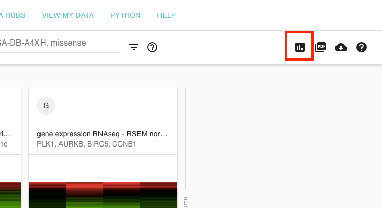

# Chart View: Box plots, Scatter plots, and bar charts

Xena Charts view will generate bar, box and scatter plots using any of the columns in a Visual Spreadsheet. Statistics, such as [Welch's t-test,](https://en.wikipedia.org/wiki/Welch's_t-test) [Pearson's](https://en.wikipedia.org/wiki/Pearson_correlation_coefficient) and [Spearman's rank correlation](https://en.wikipedia.org/wiki/Spearman's_rank_correlation_coefficient), and [ANOVA](https://en.wikipedia.org/wiki/Analysis_of_variance) will be calculated automatically.

To get to the char view click on the icon indicated below by the red box.

You can change the x- and y-axis using the controls at the bottom of the screen. Note that you can only select columns that you created as part of the Visual Spreadsheet. To add another column, click the Visual Spreadsheet icon indicated below by the red box, add a column, and come back to the Charts View.

## Examples

Bar chart and scatter plot examples: [http://xena.ucsc.edu/bar-graph-scatter-plot/](http://xena.ucsc.edu/bar-graph-scatter-plot/)

