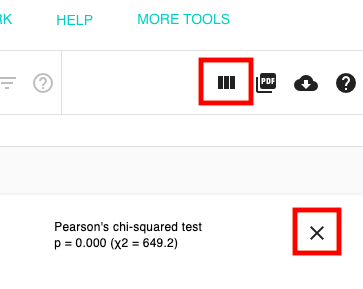

# Chart & Statistics View

Chart View will generate bar plots, box plots, violin plots, scatter plots, and distribution graphs using any of the columns in a Visual Spreadsheet. Statistics, such as [Welch's t-test,](https://en.wikipedia.org/wiki/Welch's_t-test) [Pearson's](https://en.wikipedia.org/wiki/Pearson_correlation_coefficient) and [Spearman's rank correlation](https://en.wikipedia.org/wiki/Spearman's_rank_correlation_coefficient), and [ANOVA](https://en.wikipedia.org/wiki/Analysis_of_variance) will be calculated automatically.

## Enter Chart View

To get to the chart view click on the icon indicated below by the red box or use the column menu and select 'Chart & Statistics'.

## Build a chart

Once you enter Chart View, it will ask you a series of questions about what type of graph you are trying to make.

**Compare subgroups** will allow you to compare groups of patient's samples, either those that you have made or via a categorical feature, such as sample type. It will build the appropriate graph depending on whether you have selected a continuous numerical or categorical column. This option will let you make box plots, violin plots, bar charts, and dot plots.

**See a distribution** will let you see a histogram distribution of the data in a single column. You can view the mean, median, and various standard deviations on the distribution. The column can have sub-columns, either multiple probes or multiple genes, which will instead create a plot with multiple box plots.

**Make a scatterplot** will make a scatterplot from two continuous numerical columns. The second column can have multiple sub-columns, either multiple probes or multiple genes, which will create overlapping scatterplots

If an option is grayed out, this means that you do not have enough or the right type of data on the screen. Return to the Visual Spreadsheet and add more data.

## After building a chart

If you are viewing a distribution of a continuous feature, such as gene expression for a single gene, you can add lines to the graph that indicate the mean/median or percentiles.

If you are viewing a scatterplot, you can color the points by a third column of data.

If you are viewing a dot plot, you can select if you would like to view the data as 'continuous value' where the size of the dot reflects the mean, same as the intensity of the color, or if you would like to view the data as 'single cell count data' where the size of the dot reflects the percent of cells/samples that have a non-zero value.

Advanced options available under the graph will allow you to change the scales of the axes.&#x20;

We show statistics in the bottom right corner of the screen for most graphs. If we detect it will take some time run the statistics we may instead show a button with 'run stats', so that you can decide if you would like to run the statistical test.


Note that for violin plots, the width of each plot is does not relate to the number of samples in the plot.


## Return to the Visual Spreadsheet

To return to the Visual Spreadsheet, click either the icon in the upper left, or the 'x' close button.

