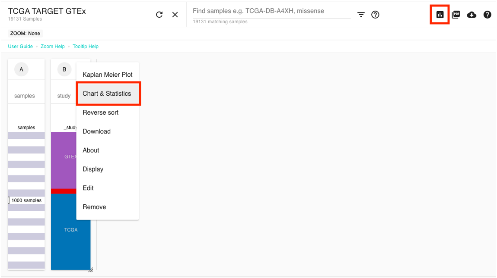
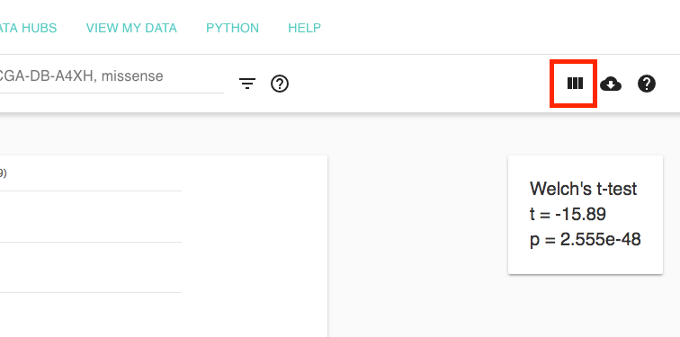
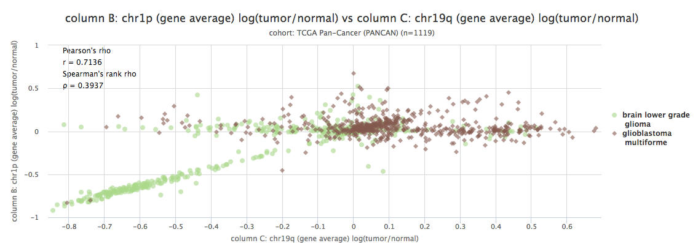
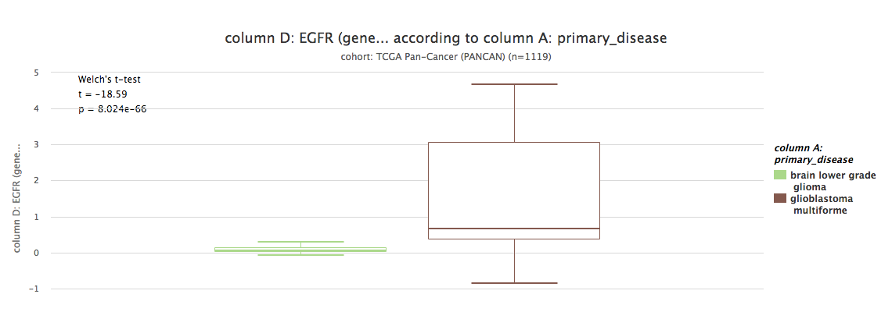

# Chart & Statistics View

Chart View will generate bar plots, box plots, violin plots, scatter plots, and distribution graphs using any of the columns in a Visual Spreadsheet. Statistics, such as [Welch's t-test,](https://en.wikipedia.org/wiki/Welch's_t-test) [Pearson's](https://en.wikipedia.org/wiki/Pearson_correlation_coefficient) and [Spearman's rank correlation](https://en.wikipedia.org/wiki/Spearman's_rank_correlation_coefficient), and [ANOVA](https://en.wikipedia.org/wiki/Analysis_of_variance) will be calculated automatically.

To get to the chart view click on the icon indicated below by the red box or use the column menu and select 'Chart & Statistics'.


Note: you can only select columns that you created as part of the Visual Spreadsheet.


To add another column, click the Visual Spreadsheet icon indicated below by the red box, add a column, and come back to the Charts View.

## Examples

### Scatter plot of arm-level deletions in gliomas 

[Live bookmark of above image](https://xenabrowser.net/heatmap/?bookmark=be9ace892275fa81257e7e03f2533b99)

Above you can see a scatter plot of Glioblastoma Multiforme \(GBM\) and Lower Grade Glioma \(LGG\) samples in TCGA. The x-axis shows copy number variation in chromosome 19q and the y-axis shows copy number variation in chromosome 1p. Samples are colored by primary disease. We can see here that there are a subset of samples in LGG that have a strong correlation between a deletion of chr19q and chr1p. GBM samples do not show this relationship.

### Box plot of EGFR copy number in gliomas 

[Live bookmark of above image](https://xenabrowser.net/heatmap/?bookmark=3b4dd2fb39fab70324c5cda834abcbba)

Above you can see a box plot of EGFR copy number variation in Glioblastoma Multiforme \(GBM\) and Lower Grade Glioma \(LGG\) samples in TCGA. We can see that GBM samples tend to have amplification of EGFR and that this trend is significant \(Welch's t-test, p&lt;0.05\).

