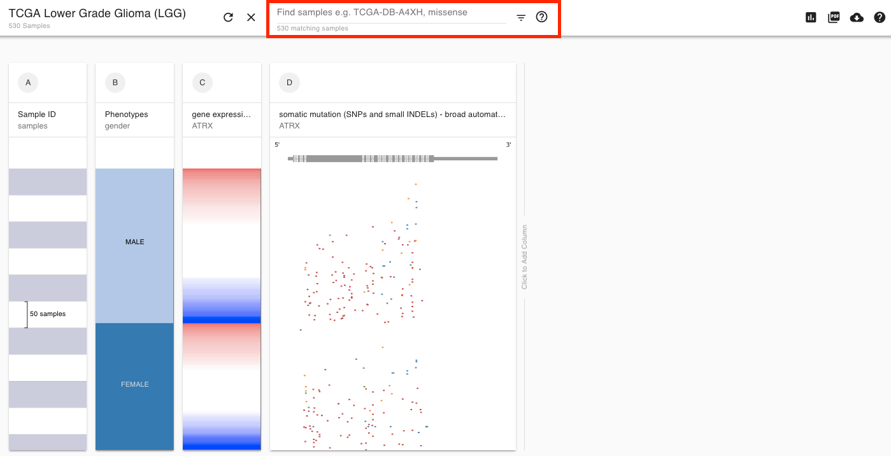

# Finding samples for filtering and subgrouping

## General Functionality

Use the box below \(in red\) to first select/highlight your samples of interest and then either zoom, filter to just these samples, or create a new subgroup column.

This bar allows you to search all data on the screen for your search term of interest \(ie. 'female' or 'missense'\). You can also enter your sample ID to see where your sample of interest falls in the plot. Samples that match your criteria are highlighted and then marked with a black bar.

Once you have your sample\(s\) of interest, click on the filter button to choose from the options in the caret menu next to it to:

**Filter:** remove samples which do not match your criteria

**Zoom:** zoom to the samples that meet your criteria. Shift-click to zoom out.

**New column:** create a new column where samples that meet your criteria are annotated as 'TRUE' and samples that don't meet your criteria are annotated as 'FALSE'. This is a great way to create subgroups for comparison via box plot or KM analysis.

## Video Tutorial

Note that a new option in the filter and subgroup menu allows users to remove samples that match their search term. Video is otherwise relevant.



Here are the steps taken in the above walk-through:

1. Select the TCGA BRCA cohort
2. Select TP53 expression and mutation
3. Find samples where column B \(expression\) is less than 10 \(i.e. have relatively low expression\)
4. Find samples that have a nonsense or frame\_shift mutation for TP53
5. Filter down to just these samples
6. Clear this filter
7. Subgroup. Make a new column where the highlighted samples are marked as 'true' and those that are not are marked as 'false'.
8. Examine new subgroups in Chart mode

## Supported search terms

### Categorical features  

Our search is 'contains' search, meaning the term you enter can be at the beginning, end or in the middle of a matched term. Our search is case-independent. An example is

> IIA

will match 'Stage IIIA' and 'Stage IIA'. To specify a specific string, use quotes

> "Stage IIA"

### Numerical and Continuous features  

You can specify a certain column and mathematical expression such as

> A:&gt;2

which will highlight all values greater than 2 in the first column. We support the following operators

* = \(equal\)
* &gt;= \(less than or equal\)
* &gt;= \(greater than or equal\)
* &lt; \(less than\)
* &gt; \(greater than\)
* != \(not equal\)

### Mutation data

You can search any annotation on a mutation, such as the functional impact, protein position, or gene name itself

To find all samples with mutations with the protein change, enter:

> V600E

To find all samples where the functional impact has 'frame' or 'nonsense'

> D:frame OR nonsense

To find all samples that have a mutation, search the gene annotation:

> TP53

To find all samples that do not have a mutation, use the negation of the gene annotation:

> !=TP53

### No data

To find all samples that do not have data in one or more columns, use:

> null

and choose 'Remove samples'. To find all samples that do not have data for just one column, use:

> B:null

### Sample IDs  

Whether the sample ID column is in view or not, it is always possible to enter a sample ID to find that one sample of interest. An example:

> TCGA-DB-A4XH

Try using 'alt-click' to freeze the tooltip for copying a sample ID. Paste into highlight feature to keep track of where that sample lies as you move columns around, changing the sort order.

### Searching a specific column  

To make it easy to search a specific column, we use shorthand to annotate the first column as 'A:', the second as 'B:', etc. An example is

> A:YES

This will search ONLY the first column for the word 'YES'. Note that we will retain your original search if you move the columns around.

### Boolean operators: OR, AND, and !=  

You can enter multiple search terms and we will match all of them with an implicit 'AND'. We also support 'OR'.

Use parentheses to group search terms. For example:

> "Stage II" \(B:Negative OR C:Negative\)

will search for samples that match 'Stage II' in any column and are 'Negative' for either the second or third column.

You can also use '!=' to negate a term such as:

> !=null

which will match all samples that have data across all columns.

## Advanced Options once subgroups are created

Once the subgroup column is created, users can further customize group labels from "true" or "false" to for exmaple "wild type" or "EGFR mutant" by adjusting the column display settings. To access these select the three dot menu at the top of the column and choose 'Display'

There is also an advanced option to create multiple subgroups \(such as three, four, etc\). Please contact us for instructions on this beta feature!

