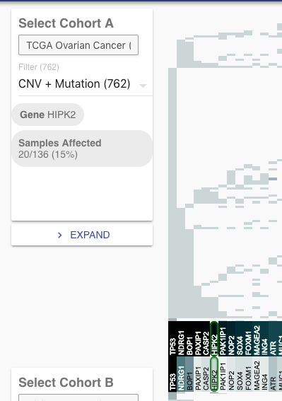
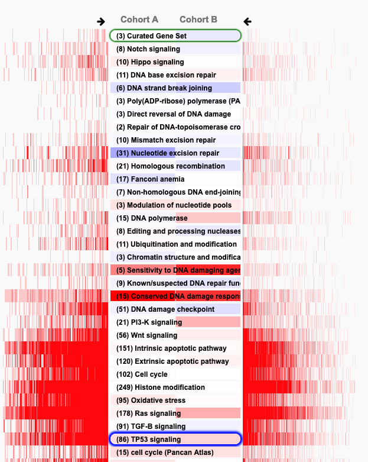
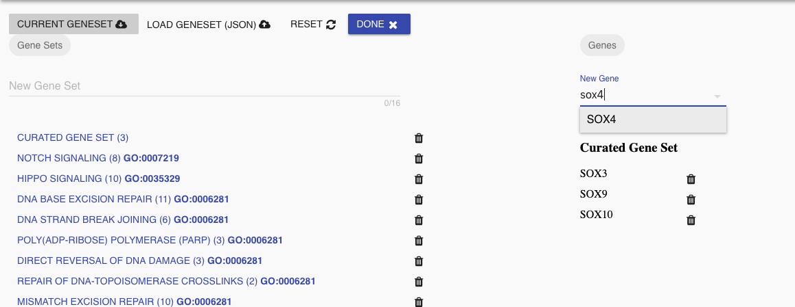
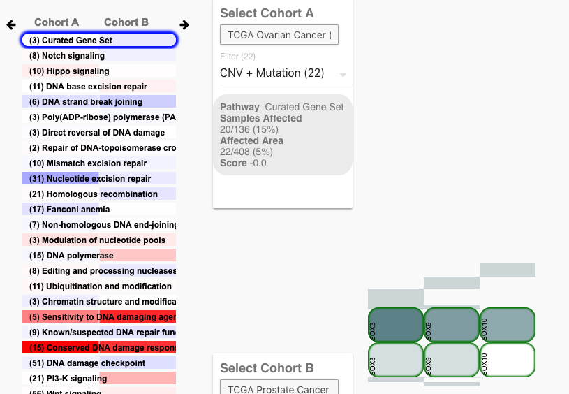
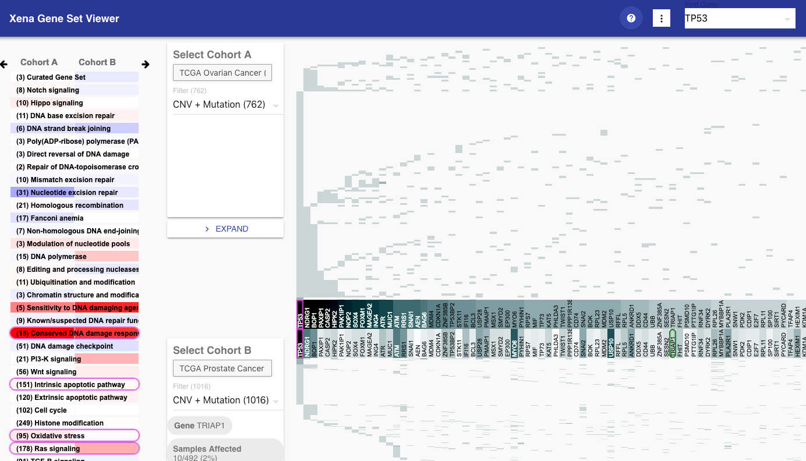

# Gene Sets Tool

The Gene Sets Tool [https://xenageneset.berkeleybop.io/xena/](https://xenageneset.berkeleybop.io/xena/) allows comparison of cancer tissue cohorts.  
It is part of the [Xena Visual Spreadsheet suite](https://xenabrowser.net/heatmap/).

Source can be found on GitHub <https://github.com/ucscXena/XenaGoWidget>.

## Overview

The Gene Set Tool allows direct comparison of individual gene sets and genes across two cancer tissue sample cohorts (Cohorts A and B).

Gene sets are list along the left (A), with Cohort A presented on the left side and Cohort B on the right side. 
Darker red indicates that expression of selected events have over-represented expression and darker blue is under-represented expression of variants.
A white color indicates that the expression is average for the expected samples.

As a user hovers over gene sets the highlighted gene set is indicated in green (C), while the selected gene set (by clicking on it) is indicated in blue. 
Genes for the selected gene set are shown in (D).  They are sorted by the by the density of the top cohort from left to right and the bottom cohort matches the gene positions.
Vertically, pixels are split by tissue samples from the cohort and darker pixes have additional hits for that sample. 
Statistics for the hovered gene sets are shown in (B).   Genes included in the hovered gene set are highlighted in green (D).

When hovering over genes labels, you get the affected area for that gene for both cohorts in the hovering box.  
When hovering over the individual sample, you get the number of hits for the gene and name of the individual sample.

or the score for the individual sample.

### Expanded Gene Set View

By clicking on the arrows at the top you can view the samples of individual gene sets.  

As you can see, because gene sets with more genes will have more affected samples, we use an expected value to calculate whether or not a gene is over represented.

 
 
### Cohort selection

There are two primary sources for cohort data:

- https://xenabrowser.net/datapages/?hub=https://tcga.xenahubs.net:443
- https://xenabrowser.net/datapages/?cohort=Cancer%20Cell%20Line%20Encyclopedia%20(Breast)

### Filter selection

Filters are selected from the cohort box, where counts for each and the combined amount are provided for each.  

Currently we provide filters for copy number variants and somatic mutations.

### Additional Options

There are several options available in the drop-down menu.

1. Colors and scale that represent genes and gene set scores may be altered from the dialogs in the option.  

1. If "Reciprocal Gene Set" is selected, then gene sets that contain any of the hovered gene set are also highlighted.

1. Data may be downloaded as JSON from the current view. 

1. Gene sets or pathways may be edited with any available gene data by selecting "Edit Pathways".

In this example we added the gene set "Curated Gene Set" and added 3 genes to it.

On clicking "Done", this is reflected below.

Gene set data can also be downloaded, edited by hand and re-uploaded. 

## Gene Search

In both the Gene Set View Pathway Editing screen, genes can be searched for.  
Once highlighted, the genes and gene sets containing those genes will be highlighted in pink. 

A similar view is provided when Editing the Pathway.

