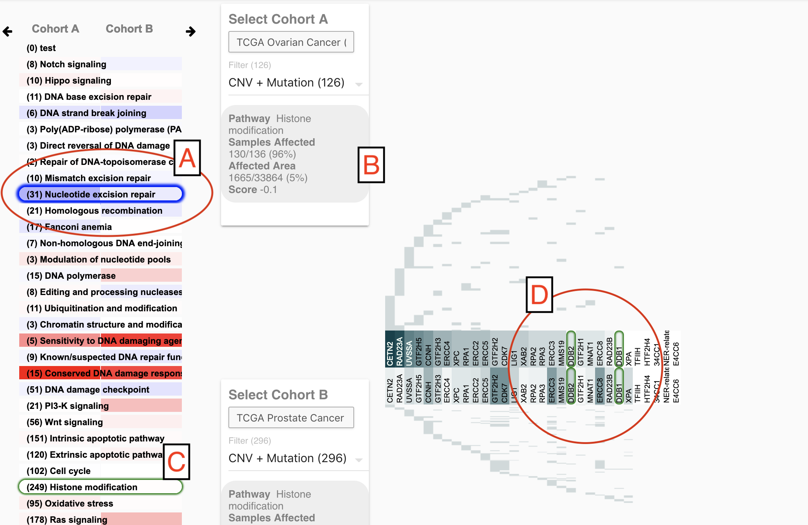
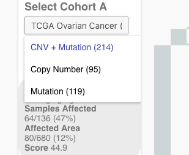
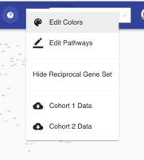

# Gene Sets Tool

The Gene Sets Tool [https://xenageneset.berkeleybop.io/xena/](https://xenageneset.berkeleybop.io/xena/) compares somatic mutation and copy number variation profile of cancer related gene sets across two cancer cohorts.

It queries genomics data hosted on public Xena Hubs, in a similar way as other tools in the Xena Visualization suite. And then it generates gene set visualizations of those data.  

Source code of the Gene Sets Tool is on [GitHub](https://github.com/ucscXena/XenaGoWidget).

## Overview

The Gene Set Tool allows direct comparison of individual gene sets and genes across two cancer cohorts \(cohort A and cohort B\).

**Section A** Gene sets are list on the left \(A\), with **Cohort A** presented on the left side and **Cohort B** on the right side. **Darker red indicates that the gene set is more perturbed** in the cohort than expected given somatic mutation and copy number variation background of the cohort samples, and **darker blue is less perturbed** then expected. White color indicates that the perturbation level is as expected.

**Section B** Detailed information in text for the moused over gene set or gene.

**Section C** As a user mouse over a gene set, it is outlined in green \(**C** and **D**\)

**Section D** User click on the gene sets in A to select one to view in detail in **D**. The selected gene set is outlined in blue in A.  In D, genes are sorted from left to right according to the % samples perturbed \(from high to low\) in the top cohort. The bottom cohort matches the top cohort's gene positions. Vertical axis is samples. 

When mouse over a gene label, you get the detailed information about that gene \(for both cohorts\).

When hovering over the individual sample, you get the number of hits for the gene and name of the individual sample.

### Expanded Gene Set View

By clicking on the arrows at the top you can view the samples of individual gene sets.

As you can see, because gene sets with more genes will have more affected samples, we use an expected value to calculate whether or not a gene is over represented.

### Cohort Selection

Use cohort dropdown

### Change Data Type

Use Data Type dropdown

Currently we provide selections for copy number variants and somatic mutations.

### Edit Pathways

Gene sets or pathways may be edited with any available gene data by selecting "Edit Pathways".

In this example we added the gene set "Curated Gene Set" and added 3 genes to it.

On clicking "Done", this is reflected below.

Gene set data can also be downloaded, edited by hand and re-uploaded.

## Additional Options

There are several options available in the drop-down menu.

#### Edit Colors

"Edit Colors" allows configuration of the color and scale that are used to represent genes and gene set scores.

#### Reciprocal Gene Sets

If "Reciprocal Gene Set" is selected, then gene sets that contain any genes in that hovered gene set are also highlighted. This could be useful when assessing other possible gene sets might be worth exploring.

#### Cohort 1 and Cohort 2 Data

Data may be downloaded as JSON by selected "Cohort 1 Data" or "Cohort 2 Data".

## Gene Search

In both the Gene Set View Pathway Editing screen, genes can be searched for.  
Once highlighted, the genes and gene sets containing those genes will be highlighted in pink.

A similar view is provided when Editing the Pathway.

## Analysis

### Gene Expression 
- BPA GENE EXPRESSION
- PARADIGM IPL
- REGULON ACTIVITY (only avaiable for LUAD)

#### Gene Set Options

### Mutation / CNV 
- CNV ∩ MUTATION
- COPY NUMBER
- MUTATION

## Sources for the somatic mutation and copy number variation data

* [https://xenabrowser.net/datapages/?hub=https://tcga.xenahubs.net:443](https://xenabrowser.net/datapages/?hub=https://tcga.xenahubs.net:443)
* [https://xenabrowser.net/datapages/?cohort=Cancer Cell Line Encyclopedia \(Breast](https://xenabrowser.net/datapages/?cohort=Cancer%20Cell%20Line%20Encyclopedia%20%28Breast)\)

