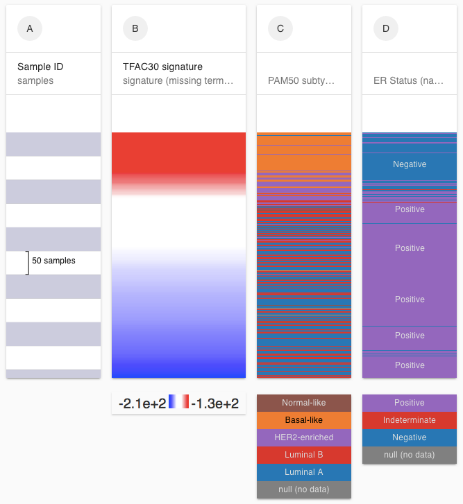

# Genomic Signatures

Genomic signatures, sometimes expressed as a weighted sum of genes, are an algebra over genes, such as "ESR1 + 0.5\*ERBB2 - GRB7". Once a signature is entered, the value for each gene name for each sample are substituted and the algebraic expression is evaluated.

## Entering a signature

1. Open the Add column menu
2. Enter '=' and then your signature into the gene entry box
3. Select 'gene expression' as the dataset
4. Click 'Done'


There must be a space on both sides of the "+" and "-".

Alternatively enter a list of genes and we will automatically add a '+' in between each gene when evaluating the signature



If we can not find a gene that is part of the signature, the missing gene will be included as a zero in the expression calculation and the label will list the genes as missing.


## Example: TFAC30 Gene Signature

Hess et.al. identified 30 genes whose gene expression profile is predictive of complete pathologic response to chemotherapy treatment in breast cancer.

### Gene signature

=E2F3 + MELK + RRM2 + BTG3 - CTNND2 - GAMT - METRN - ERBB4 - ZNF552 - CA12 - KDM4B - NKAIN1 - SCUBE2 - KIAA1467 - MAPT - FLJ10916 - BECN1 - RAMP1 - GFRA1 - IGFBP4 - FGFR1OP - MDM2 - KIF3A - AMFR - MED13L - BBS4

Here we can see that the predicted chemo response signature is high in the basal subtype and low in luminal subtype. Additionally, the signature is high for ER negative samples and low for ER positive samples.

Bookmark: [https://xenabrowser.net/?bookmark=2401ccb792e256d7397008b24af20565](https://xenabrowser.net/?bookmark=2401ccb792e256d7397008b24af20565)

[Hess KR, et. al. Pharmacogenomic predictor of sensitivity to preoperative chemotherapy with paclitaxel and fluorouracil, doxorubicin, and cyclophosphamide in breast cancer. J Clin Oncol. 2006 Sep 10;24\(26\):4236-44. Epub 2006 Aug 8.](https://www.ncbi.nlm.nih.gov/pubmed/16896004)

## Signatures datasets

We also have a number of signature datasets under the [TCGA Pan-Cancer study ](https://xenabrowser.net/heatmap/?bookmark=5a4f27dd19ac8a4aba050eee834e9d31)from the PanCan Atlas project: 

* [gene programs](https://xenabrowser.net/datapages/?dataset=Pancan12_GenePrograms_drugTargetCanon_in_Pancan33.tsv&host=https%3A%2F%2Fpancanatlas.xenahubs.net)
* [HRD score, genome-wide DNA damage footprint](https://xenabrowser.net/datapages/?dataset=TCGA.HRD_withSampleID.txt&host=https%3A%2F%2Fpancanatlas.xenahubs.net)
* [Immune Signature Scores \(Denise Wolf et al\)](https://xenabrowser.net/datapages/?dataset=TCGA_pancancer_10852whitelistsamples_68ImmuneSigs.xena&host=https%3A%2F%2Fpancanatlas.xenahubs.net)
* [Stemness score \(DNA methylation based\)](https://xenabrowser.net/datapages/?dataset=StemnessScores_DNAmeth_20170210.tsv&host=https%3A%2F%2Fpancanatlas.xenahubs.net)
* [Stemness score \(RNA based\)](https://xenabrowser.net/datapages/?dataset=StemnessScores_RNAexp_20170127.2.tsv&host=https%3A%2F%2Fpancanatlas.xenahubs.net)

To use these signatures, go to the dataset pages \(links above\) to see what the names of the specific signatures are \(under Identifiers\). Then in the visualization enter the name of the specific signature as a gene, click 'Advanced', choose the appropriate dataset, and click 'Done'

