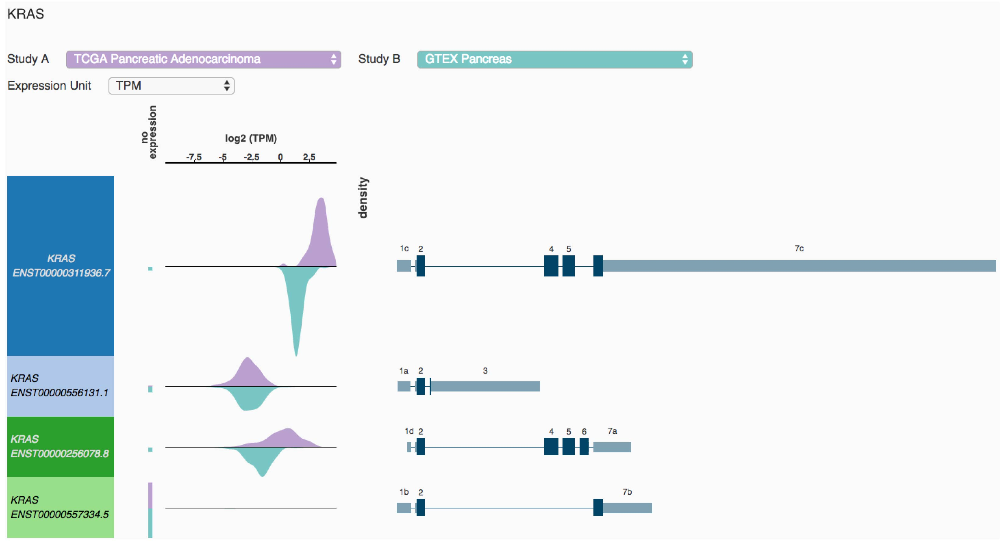

# Transcript View

## About 

The Transcript View shows transcript-specific expression or isoform percentage for 'tumor' TCGA data and 'normal' GTEX data. It allows you to compare the distribution of these values for two groups of samples.

This tool was created by Akhil Kamath as part of Google Summer of Code 2017. Akhil was advised by [Angela Brooks](https://brookslab.soe.ucsc.edu/) and [Brian Craft](https://github.com/acthp). Thank you Akhil for all your work!

## Usage 

Enter the HUGO name of your gene of interest and click 'OK'. Choose your two studies of interest from the two drop down menus. Each row in the visualization shows the transcript, transcript structure and density plots showing range of expression of that transcript.

Change the units from TMP \(Transcripts Per Million\) to isoform percentage using the drop-down near the top. To zoom on a row, click on it. To zoom out, click on the row again.

## Data behind the view

All RNAseq data was generated by the [Toil pipeline recompute](https://xenabrowser.net/datapages/?host=https://toil.xenahubs.net) done by the UCSC Computational Core using the RSEM package. All transcripts are from [Gencode V23 comprehensive annotation](https://www.gencodegenes.org/human/release_23.html).

## Exon numbering 

For this visualization, we numbered the exons using an in-house automated method which may not line up with exon numbering in the literature. This method is subject to change and should not be relied on to denote any exon going forward.

Regions that are intronic in all transcripts are removed. The remaining exonic regions are numbered 1..N. Different exons within a given region are labeled starting with ‘a’ for the left-most exon \(in transcript direction\).

For example, exon 3 is the unique exon in the third exonic region. Exons 4a and 4b are two different exons in the fourth exonic region.

Another way to say this is: different exons across all transcripts which overlap transitively will be assigned the same integer. So if one transcript has exons 4a and 4c, there must be exons in other transcripts that overlap them, and each other.

