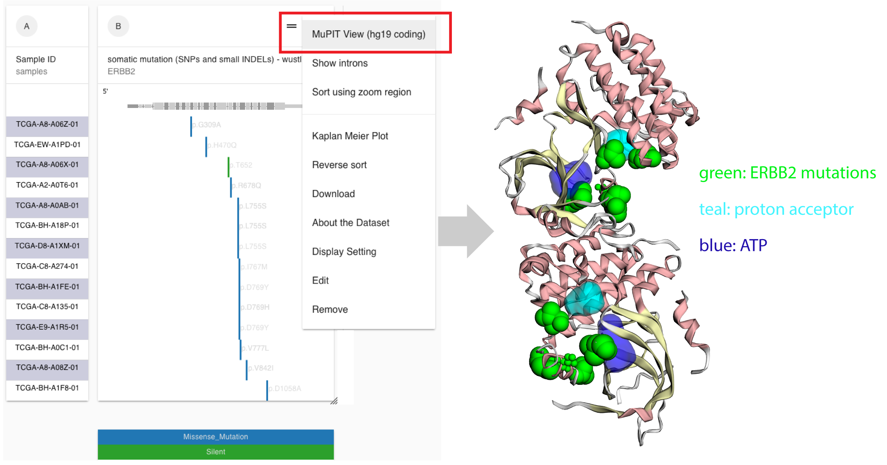

# MuPIT

We use the [MuPIT 3D protein viewer](http://mupit.icm.jhu.edu/) from [Rachel Karchin's lab](http://karchinlab.org/) at John Hopkins to provide this visualization to our users. From their Help Page:

> MuPIT interactive is an online tool that allows you to map sequence variants from their genomic position onto protein structures. Viewing a variant on protein structure can be useful in interpreting its potential biological consequences. After mapping, the variants are displayed on an interactive 3d structure. The user may turn variants on and off, and display annotations on the protein structure.

Access this tool by going to our [Visualization tab](https://xenabrowser.net/heatmap/) and following the wizard to select samples. Next, enter your gene of interest, click 'somatic mutation' and then click 'Done'. You may need to choose another variable such as 'gene expression'.

Once you have the mutation data you're interested in, click the menu at the top of the column and chose 'MuPIT View'. This will send your mutation data to MuPIT and open their viewer in a new tab.

MuPIT Help: [http://mupit.icm.jhu.edu/MuPIT\_Interactive/Help.html](http://mupit.icm.jhu.edu/MuPIT_Interactive/Help.html)

## Example

[Live bookmark of above image](https://xenabrowser.net/heatmap/?bookmark=6098aca9a00041d6271f18f2b471a241)

On the left of the figure is Xena mutation column view of ERBB2 somatic mutations from the TCGA breast cancer cohort. Users click on the MuPIT link from the caret menu at the top of the column. It will send all the mutations' genomic positions as well as their recurrence p-values to the MuPIT display. On the right side of the figure, MuPIT displays mutations in various size of bright green spheres. Large spheres for recurrent mutations. Size of the mutation spheres are determined by recurrence p values. The MuPIT display shows these ERBB2 somatic mutations cluster around the ERBB2 active site \(ATP binding site in blue and proton acceptor site in teal\).

