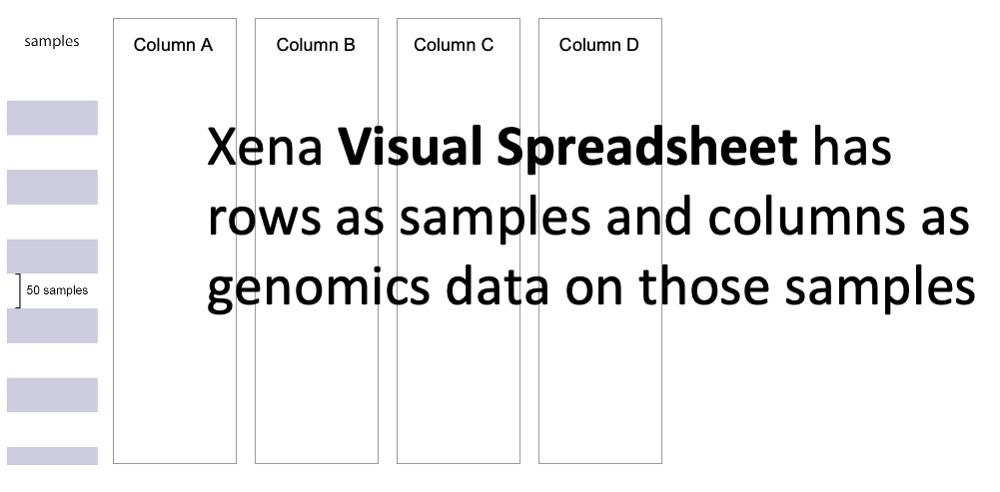
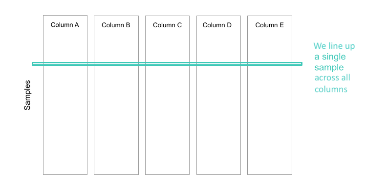
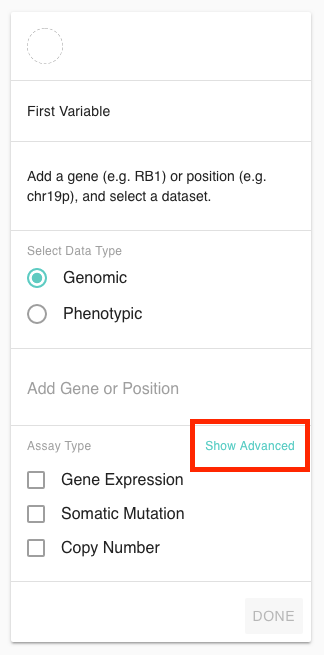
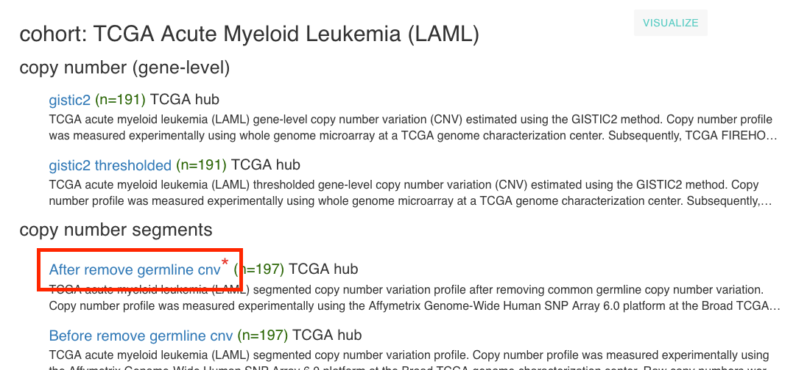
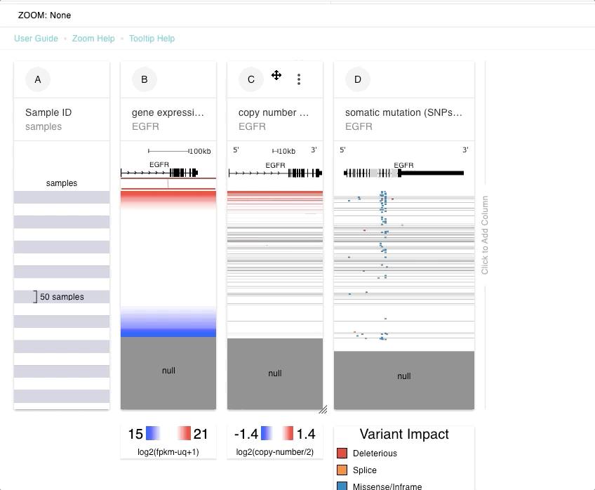
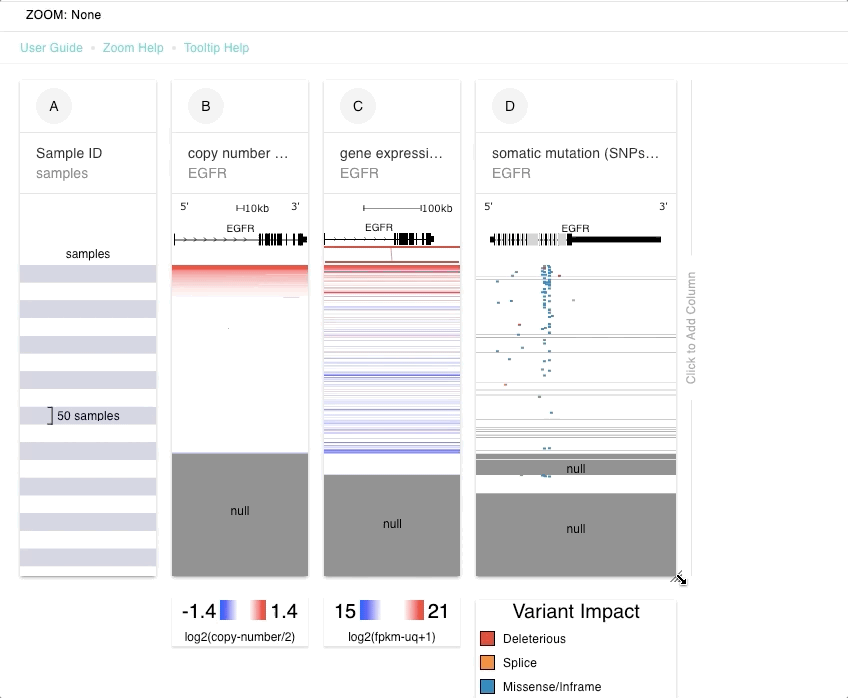

# Visual Spreadsheet

The Visual Spreadsheet allows you to add an arbitrary number of columns of any data type \(mutation, copy number, expression, protein, phenotype, methylation, etc\) into a spreadsheet-like view. We line up all columns so that each row is the same sample, allowing you to easily see trends in the data. Data is always sorted left to right and sub-sorted on columns thereafter.

Get started by going to the [Xena Browser](https://xenabrowser.net/heatmap/) and following the wizard to enter your data of interest.

## Making a Visual Spreadsheet

The wizard on the screen will guide you to choose a study to view and TWO columns of data to view on those samples. Note that if you do not choose at least two columns, the wizard will not exit and let you interact with the data.

### Selecting a cohort

You can select a cohort either by choosing 'Help me select a cohort' and searching our cohorts for you cancer type, etc. or by choosing 'I know the study I want to use' and searching for the partial or full name of the cohort you are interested in.

### Adding a Gene or Position

Please use HUGO gene names or the probe names in the dataset. You can enter one gene or multiple genes. Separate multiple genes with a space, comma, tab, or new line.

To display a genomic region, enter the genomic region, choose your dataset and click 'done'. We accept entire chromosomes \(e.g. chr1\), arms of chromosomes \(e.g. chr19q\), or chromosomes coordinates. Coordinates need to be in this format: chr1:100-4,000. 

### Selecting a Dataset

To finish making a column you will need to select one or more datasets. 

#### Basic Datasets

We have pre-selected default datasets for most cohorts. These datasets are selected based because they are the most used datasets. Typically there is a default mutation, copy number, and expression dataset. 

#### Advanced Datasets

Xena also has more datasets than those listed in the Basic Menu. Depending on the cohort, these can include DNA methylation, exon expression, thresholded CNV data and more. To access them, click on 'Show Advanced' below:

#### **More information on basic datasets**

We annotate datasets used in the basic Visual Spreadsheet wizard with a red asterisk in our datasets pages. For an example see: [https://xenabrowser.net/datapages/?cohort=TCGA%20Acute%20Myeloid%20Leukemia%20\(LAML\)](https://xenabrowser.net/datapages/?cohort=TCGA%20Acute%20Myeloid%20Leukemia%20%28LAML%29)

### Video of making a Visual Spreadsheet

## After you made a Visual Spreadsheet

### Overview

Samples are on the y-axis and your columns of data are on the x-axis. We line up all columns so that each row is the same sample, allowing you to easily see trends in the data. Data is always sorted left to right and sub-sorted on columns thereafter.

#### If you entered a single gene

If you entered a single gene, that gene will be listed at the top of the column. If there are multiple probes mapped to that gene in the dataset you selected they will be displayed as subcolumns ordered left to right in the direction of transcription.

If you selected a positional dataset, such as segmented copy number variation or mutation we will display the gene model will be displayed at the top of the column. The gene model is a composite of all transcripts of the gene. Boxes show different exons with UTR regions being short and CDS regions being tall. We display 2Kb upstream to show the promoter region. Use the column menu to toggle to show intronic regions.

#### If you entered multiple genes

If you entered multiple genes, each gene will be listed as a subcolumn for that dataset. If there are multiple probes mapped to that gene in the dataset \(i.e. if you entered a single gene then you would see the probes as subcolumns\), then the probes are averaged for a single value per gene. 

Note that if you entered more than one gene and selected a mutation dataset, we will only show the first gene. If you wish to see multiple mutation columns, please enter each gene individually and click 'done'

#### If you entered a chromosome or chromosome position

When displaying a chromosome range, genes will be shown at the top of the column, with dark blue genes being on the forward strand and red genes being on the reverse strand. Hovering over a gene will display the gene name in the tooltip. Note that introns are always shown in this mode.

### Data values

Individual values for each dataset mean different things. The legend at the bottom of the dataset will tell you the units for your particular dataset, including any normalization that was performed. If a sample does not have data for a column, it will show as gray and be labeled as 'null'.

If the entire column is gray this means we did not recognize your gene, probe, or position. If you believe this to be in error, please try an alternate name.

More information about a dataset can be found in the dataset details page. To get there, click on the column menu and choose 'About'.

### Sample sorting

The Xena Browser uses y axis for samples, x axis/columns for genomic/phenotypic features. Data from a single sample is always on the same horizontal line across all columns. Linking samples across columns allows you to see screen-wide trends. The Xena Browser orders samples left to right first by the first columns, then the second, etc. If there are multiple genes, identifiers, probes within in a column, samples is ordered from left to right by 1st sub-column, then 2nd sub-column, and so on. 

Numerical data \(e.g. 1.2, 3.5, etc\) are ordered in descending order \(e.g. 3.5, 1.2, ...\). Categorical data \(e.g. stage, tumor type, etc\) are ordered by categories. CNV data is sorted by the average of the entire column. Positional mutation data is ordered by by genomic coordinates \(from 5'-&gt;3'\) and then by type of mutation \(mutations that destroy the transcript such as frameshift, mutations that change the transcript such as missense, silent mutations such as UTR mutations\). For both the CNV and positional mutation data, you can choose to instead sort by the region you are zoomed to. Click the columns menu at the top of the column and choose  'Sort by zoom region avg'.

To reverse the ordering for any column, click the column menu at the top of the column and chose 'Reverse sort'

### Move a column/change the sample sorting

As the sample sort order is controlled by the left most columns, it can be useful to explore the data by moving a different column to the left. 

To move a column click on the column header and drag a column to the right or left.

### Zooming

Click and drag any where in any column to zoom in in either direction. Zoom out to all samples by clicking the 'Clear Zoom' at the top. Zoom out to the whole column by clicking the red 'x' at the top of a column.

### Tooltip

The Tooltip at the top of the Visual Spreadsheet shows more information about the data under the mouse. Links are links to the UCSC Genome Browser to learn more about that gene or genomic position. Alt-click to freeze and unfreeze the tooltip to be able to click on the links. [Click here for more information about interacting with the tooltip](../../how-do-i/freeze-and-un-freeze-tooltip.md).

### Resize a column

You can change the size of a column by clicking on the bottom right corner of a column and dragging to a new size.

### Add another column

You can add another column of data by clicking on 'Click to add column' either on the right edge of the visual spreadsheet or by hovering between columns until 'Click to insert column' displays'.

