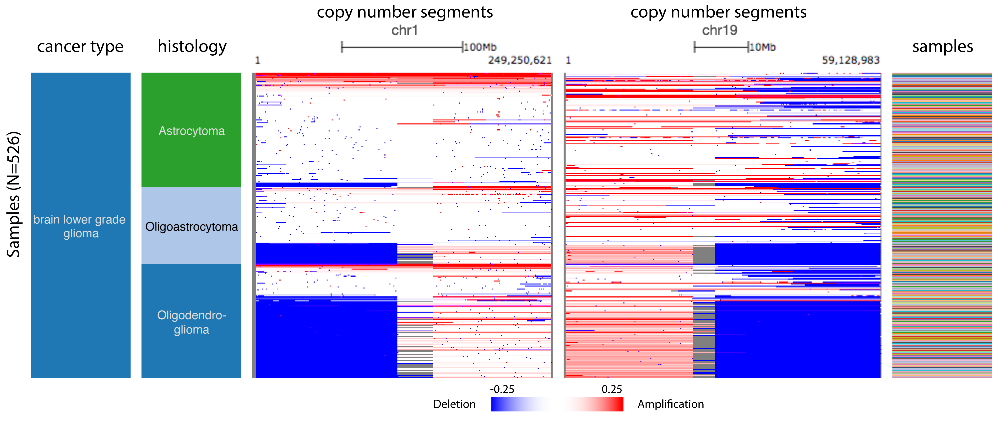
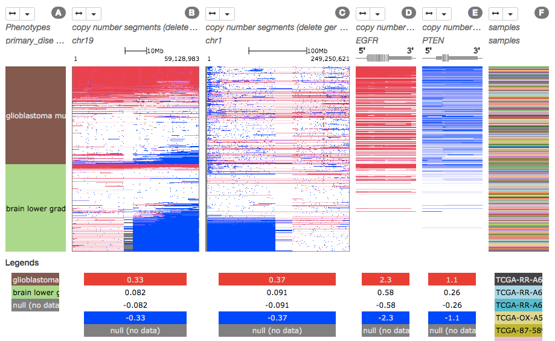
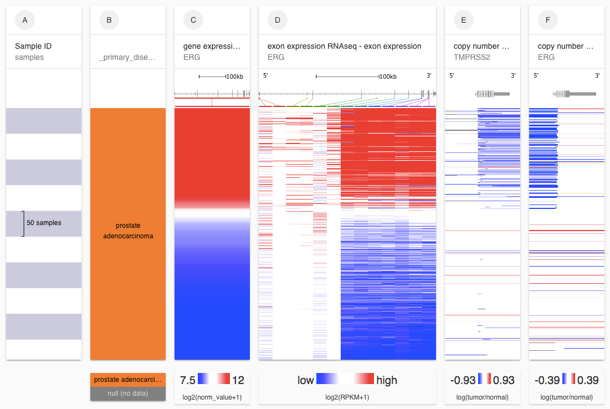
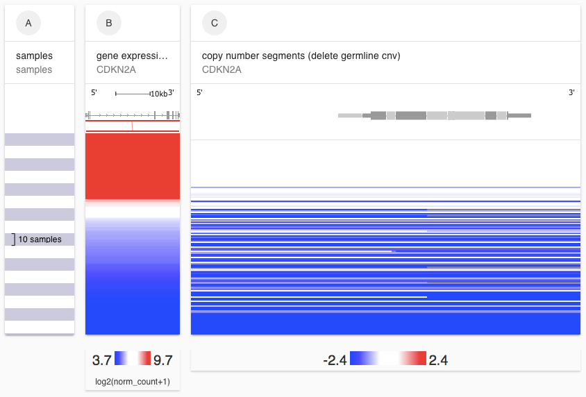
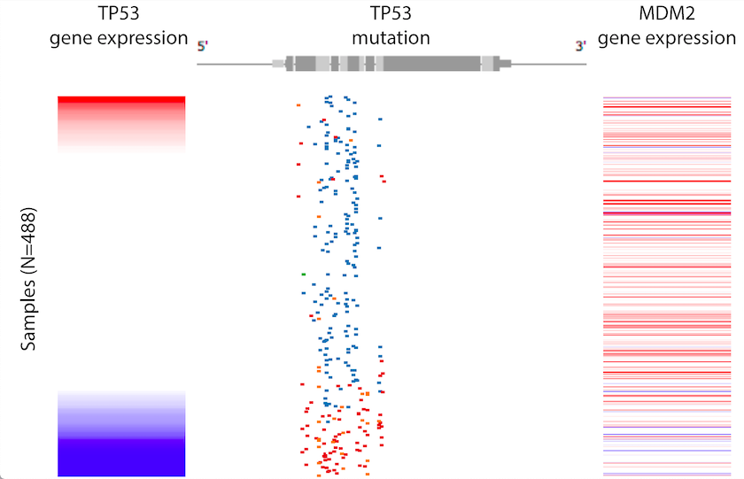
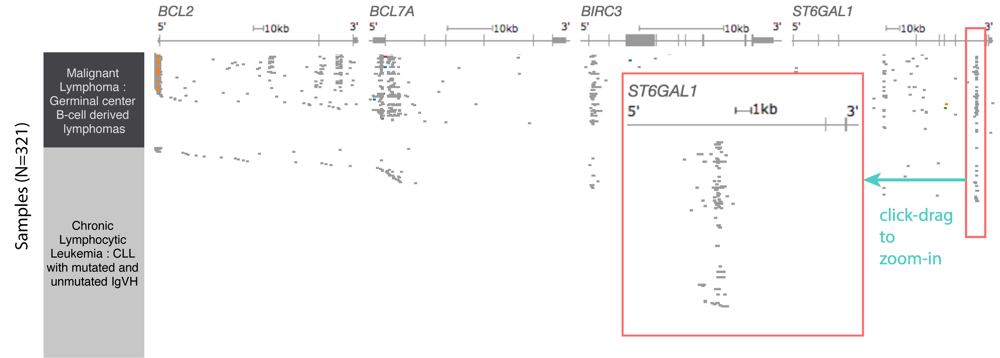

# Coloring for Mutation Columns

Mutation data is colored by the functional impact:

* Red - Deleterious
* Blue - Missense
* Orange - Splice site mutation
* Green - Silent
* Gray - Unknown

### **More details for 'S**omatic mutation \(SNP and INDEL\)' datasets

**Red** --&gt; Nonsense\_Mutation, frameshift\_variant, stop\_gained, splice\_acceptor\_variant, splice\_acceptor\_variant&intron\_variant, splice\_donor\_variant, splice\_donor\_variant&intron\_variant, Splice\_Site, Frame\_Shift\_Del, Frame\_Shift\_Ins

**Blue** --&gt; splice\_region\_variant, splice\_region\_variant&intron\_variant, missense, non\_coding\_exon\_variant, missense\_variant, Missense\_Mutation, exon\_variant, RNA, Indel, start\_lost, start\_gained, De\_novo\_Start\_OutOfFrame, Translation\_Start\_Site, De\_novo\_Start\_InFrame, stop\_lost, Nonstop\_Mutation, initiator\_codon\_variant, 5\_prime\_UTR\_premature\_start\_codon\_gain\_variant, disruptive\_inframe\_deletion, inframe\_deletion, inframe\_insertion, In\_Frame\_Del, In\_Frame\_Ins

**Green** --&gt; synonymous\_variant, 5\_prime\_UTR\_variant, 3\_prime\_UTR\_variant, 5'Flank, 3'Flank, 3'UTR, 5'UTR, Silent, stop\_retained\_variant

**Orange** --&gt; others, SV, upstream_gene_variant, downstream\_gene\_variant, intron\_variant, intergenic\_region

**For the gene-level mutation datasets \(Somatic gene-level non-silent mutation\):**

**Red \(=1\)** --&gt; indicates that a non-silent somatic mutation \(nonsense, missense, frame-shif indels, splice site mutations, stop codon readthroughs, change of start codon, inframe indels\) was identified in the protein coding region of a gene, or any mutation identified in a non-coding gene

**White \(=0\)** --&gt; indicates that none of the above mutation calls were made in this gene for the specific sample

**Pink \(=0.5\)** --&gt; some samples have two aliquots. In the event that in one aliquot a mutation was called and in the other no mutation was called, we assign a value of 0.5.

## CNV Examples

### Co-deletions in Lower Grade Glioma 

[Live bookmark of above image](https://xenabrowser.net/heatmap/?bookmark=fdb3fa1573bc4f293281c6059e7ca702)

For each of the three subtypes of TCGA Lower Grade Glioma, you can see corresponding deletions in chromosome 1p \(3rd column from the left\) and chromosome 19q \(4th column\).

### Deletions and Amplifications in Gliomas 

[Live bookmark of above image](https://xenabrowser.net/?bookmark=3001c94bea71d6b0aa9de085ef02f637)

Looking more broadly at Glioblastoma Multiforme \(GBM\) and Lower Grade Glioma \(LGG\) in TCGA \(column A\), we can see the same arm-level co-deletions in chr1p \(column B\) and chr19q \(column C\) primarily in LGG tumors. Columns D and E show us an amplification in EGFR and a deletion in PTEN, both of which are associated with GBM rather than LGG tumors.

### TMPRSS2-ERG Fusion in TCGA Prostate Cancer 

[Live bookmark of above image](https://xenabrowser.net/?bookmark=2b2360ede42b216a0c26f9497f44fc4f)

We can use the segmented CNV data to more closely examine the well-known TMPRSS2-ERG fusion in Prostate Cancer, where the oncogene ERG fuses to the TMPRSS2 promoter, driving over-expression of ERG \(St. John 2012, Adamo 2016\). We can see in columns D and E the specific break point in each gene and their relationship to over expression in ERG \(column A\). Looking more closely at which exons are over expressed, we can see that it is primarily in the 3' exons.

### CDKN2A deletion in TCGA Glioblastoma 

[Live bookmark of above image](https://xenabrowser.net/heatmap/?bookmark=eb986c8444a858756a047fb8311a930f)

Using the segmented CNV dataset we can see the relationship between CDKN2A deletion and lowered CDKN2A expression in TCGA Glioblastoma.

## Mutation Examples

### Mutation and Expression data side-by-side

[Live bookmark to above view](https://xenabrowser.net/heatmap/?bookmark=3bb71b72f169530783d24a40dcdaeff4)

View mutations side-by-side with other data, such as gene expression. As shown above in TCGA Lung Adenocarcinoma \(LUAD\), lower TP53 expression correlates with nonsense, frame-shift mutations; and higher expression is associated with missense mutations.

### Intronic Mutations in ICGC Lymphoma Cohorts

[Live bookmark of above image](https://xenabrowser.net/heatmap/?bookmark=27d8bc5b7904f768374a1eeae9baed81)

Xena mutation views supports examination of both coding and non-coding mutations from whole genome analysis. We support viewing mutations from both gene- or coordinate- centric perspective. In the gene-centric view, you can dynamically toggle to show or hide introns from the view. This figure shows the frequent intron mutations in 321 samples from the ICGC lymphoma cohorts. These 'pile-ups' would be not be visible if viewing mutations only in the exome. These intron mutations overlap with known enhancers regions \(Mathelier 2015\).

Mathelier A, Lefebvre C, Zhang AW, Arenillas DJ, Ding J, Wasserman WW, Shah SP. Cis-regulatory somatic mutations and gene-expression alteration in B-cell lymphomas Genome Biology. 2015; 16:84.

