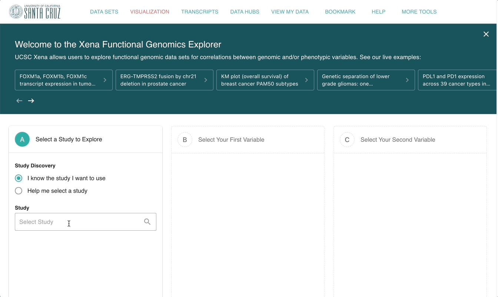
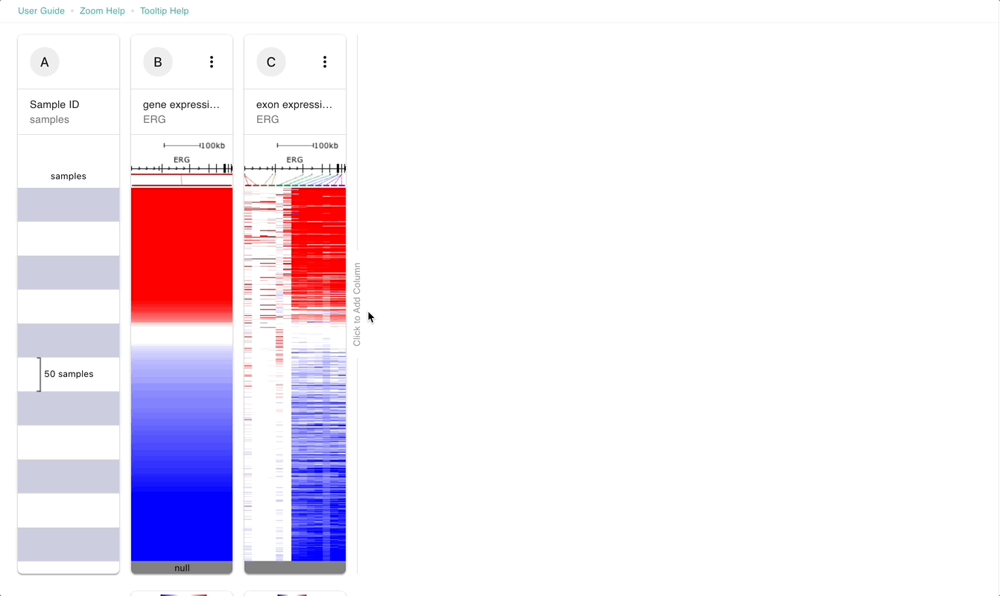

# Advanced Tutorial: Section 1

## Description 

This tutorial is made for those who have basic knowledge of how to use Xena. We will cover how to view whole chromosome and how to use the advanced dataset menu to access datasets such as exon expression.

## Prerequisites 

This tutorial assumes basic knowledge of how to build and read a [Visual Spreadsheet](../overview-of-features/visual-spreadsheet/). To get this, go through [Basic Tutorial: Section 1](basic-tutorial-section-1.md).

## Estimated time needed 

10 min‌

## Learning goals 

Create a visual spreadsheet that with a chromosome-wide column and data from the advanced dataset menu.

## Tutorial 

We will look at the _ERG-TMPRSS2_ gene fusion in patients from the TCGA Prostate Cancer study.

_ERG_ is an oncogene that expressed at low levels in normal prostate tissue. Some patient's prostate cancer samples have higher expression of _ERG_. These samples tend to have an intra-chromosomal deletion that fuses _ERG_ to _TMPRSS2_. _TMPRSS2_ is expressed at high levels in normal prostate tissue. This allows _ERG_ to use the _TMPRSS2_ promoter to increase _ERG_ expression.



#### [​Ending Screenshot​](https://xenabrowser.net/?bookmark=6ea137951fb4ddad4c8a6baaac3914f4) 


Note that column D may look slightly different, depending on how you resize and zoom the column.


We can now see that there are many patient's samples with relatively high expression of _ERG_ (column B). This relatively high expression is not uniform across the exons of _ERG_, but instead is in the exons closer to the 3' end of the gene (column C). Looking at column D, we can see that these samples also have an intra-chromosomal deletion of part of chromosome 21. If we hover over the genes at either end of the deletion, we can see that the end points fall within _ERG_ and _TMPRSS2_.&#x20;

#### Steps 

1. Start at [https://xenabrowser.net/](https://xenabrowser.net/)
2. Type 'TCGA Prostate Cancer (PRAD)', select this study from the drop down menu, and click 'To first variable'.
3. Type '_ERG_', select the checkbox for Gene Expression and click 'To second variable'.
4. Type '_ERG_', click 'Show Advanced', select the checkbox for 'IlluminaHiSeq' under 'exon expression RNAseq', and click 'Done'.
5. Click the text 'Click to insert a column' after column C. Type 'chr21', select the checkbox for Copy Number and click 'Done'.
6. Click on the filter menu and select 'Remove samples with nulls'
7. Click on the  handle in the lower right corner of column E, copy number for chromosome 21. Move it to the right to make the column bigger.&#x20;
8. Click and drag within column E, copy number for chromosome 21 to zoom into the intra-chromosomal deletion.

#### Video of steps 1-4 

<figure><figcaption></figcaption></figure>

#### ‌**Video of steps 5-8**

<figure><figcaption></figcaption></figure>


More information:

* [Advanced dataset menu](../overview-of-features/visual-spreadsheet/#advanced-datasets)
* [Visual Spreadsheet](../overview-of-features/visual-spreadsheet/)


## Test your knowledge 



Add copy number data for chromosome 1.



****[**Ending Screenshot**](https://xenabrowser.net/?bookmark=95d77b2d3107653fa2a7be51424f0a04)****






Add DNA Methylation data for _ERG_.



****[**Ending Screenshot**](https://xenabrowser.net/?bookmark=3b8cf8fa103e5fe2d718337551af34a4)****



