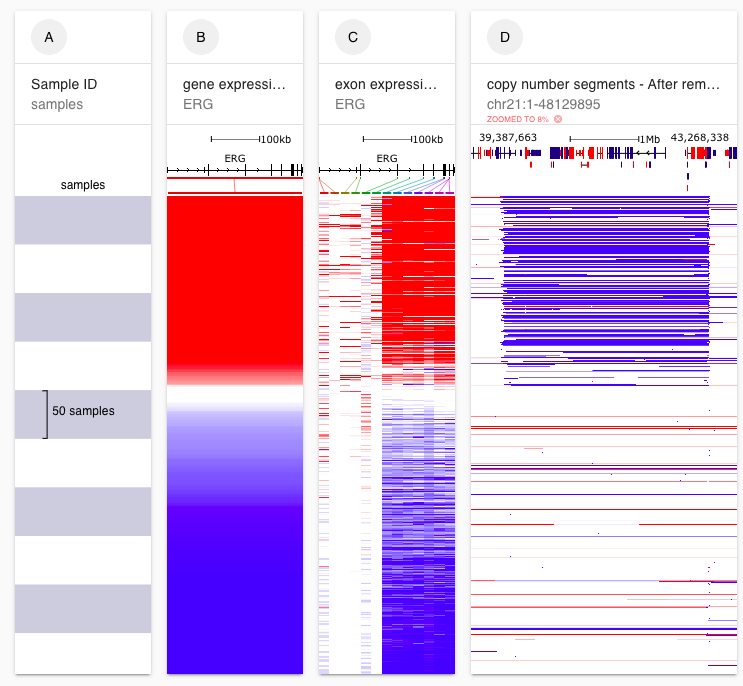
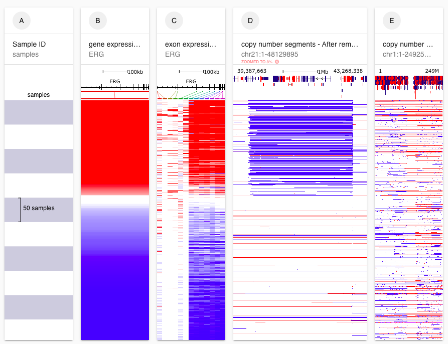
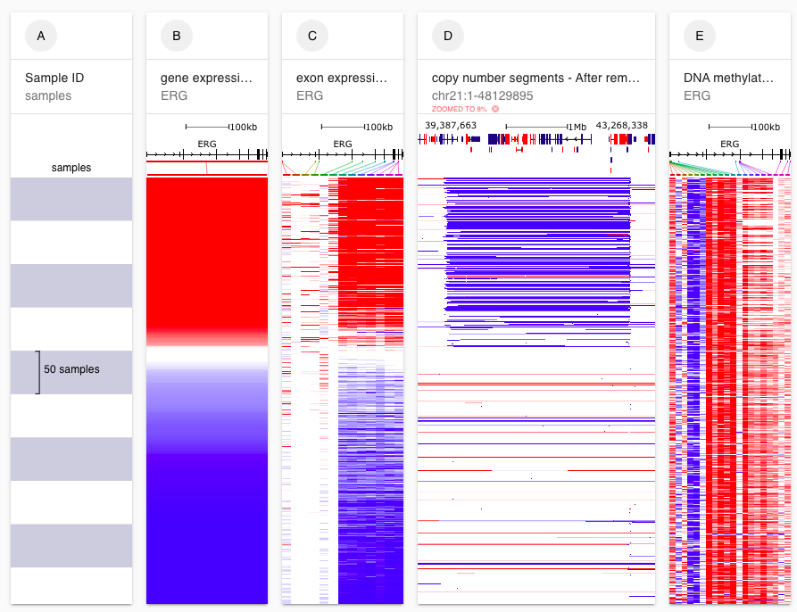

# Advanced Tutorial: Section 1

## Description 

This tutorial is intended for those who have a basic understanding of how to use Xena. We will cover how to view whole chromosome and how to use the advanced dataset menu to access datasets such as exon expression.

## Prerequisites 

This tutorial assumes completion of the [Basic Tutorial: Section 1](https://app.gitbook.com/@ucsc-xena/s/project/tutorials/basic-tutorial-section-1). Completion of [Basic Tutorial: Section 2](https://app.gitbook.com/@ucsc-xena/s/project/tutorials/basic-tutorial-section-2) and [Basic Tutorial: Section 3](basic-tutorial-section-3.md) is recommended but not required. 

## Estimated time needed 

10 min‌

## Learning goals 

Create a visual spreadsheet that include a chromosome-wide column and data from the advanced dataset menu

## Tutorial 

We investigate the _ERG-TMPRSS2_ gene fusion and _TMPRSS2_ promoter hijacking in TCGA Prostate Cancer.

_ERG_ is an oncogene that expressed at low levels in normal prostate tissue. Some prostate cancer samples have higher expression of _ERG_. These samples tend to have an intra-chromosomal deletion that fuses _ERG_ to _TMPRSS2_. As _TMPRSS2_ is expressed at high levels in normal prostate tissue, this allows _ERG_ to hijack the _TMPRSS2_ promoter which leads to increased _ERG_ expression.



#### [​Ending Screenshot​](https://xenabrowser.net/?bookmark=6ea137951fb4ddad4c8a6baaac3914f4) 


Note that column D may look slight different, depending on how resize and zoom the column.


#### Steps 

1. Start at [https://xenabrowser.net/](https://xenabrowser.net/)
2. Type 'TCGA Prostate Cancer \(PRAD\)', select this study from the drop down menu, and click 'Done'.
3. Type '_ERG_', select the checkbox for Gene Expression and click 'Done'.
4. Type '_ERG_', click 'Show Advanced', select the checkbox for 'IlluminaHiSeq' under 'exon expression RNAseq', and click 'Done'.
5. Click the text 'Click to insert a column' after column C. Type 'chr21', select the checkbox for Copy Number and click 'Done'.
6. Click on the filter menu and select 'Remove samples with nulls'
7. Click on the  handle in the lower right corner of column E, copy number for chromosome 21. Move it to the right to make the column bigger. 
8. Click and drag within column E, copy number for chromosome 21 to zoom into the intra-chromosomal deletion.

#### Video of steps 1-4 

#### ‌**Video of steps 5-8**


More information:

* [Advanced dataset menu](../overview-of-features/visual-spreadsheet/#advanced-datasets)
* [Visual Spreadsheet](../overview-of-features/visual-spreadsheet/)


## Test your knowledge 



Add copy number data for chromosome 1.



\*\*\*\*[**Ending Screenshot**](https://xenabrowser.net/?bookmark=95d77b2d3107653fa2a7be51424f0a04)\*\*\*\*






Add DNA Methylation data for _ERG_.



\*\*\*\*[**Ending Screenshot**](https://xenabrowser.net/?bookmark=3b8cf8fa103e5fe2d718337551af34a4)\*\*\*\*




