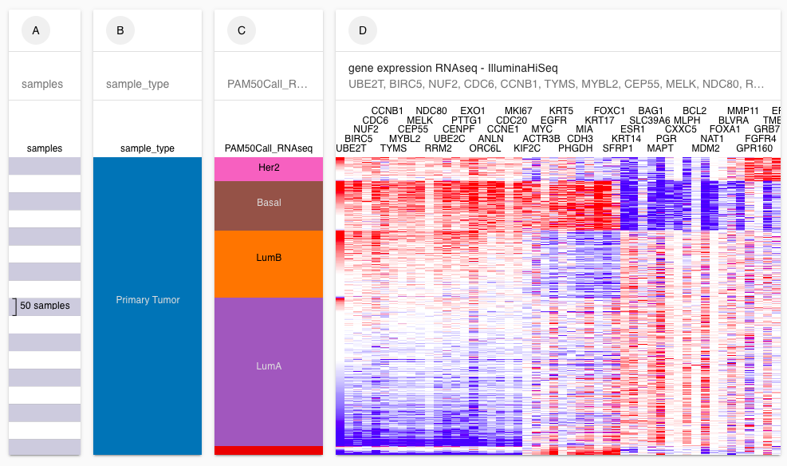
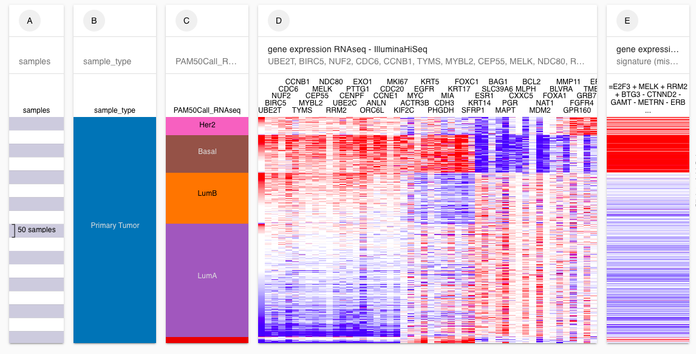

# Advanced Tutorial: Section 2

## Description 

This tutorial is intended for those who have a basic understanding of how to use Xena. We will cover how to use the pick samples feature, how to view multiple genes in a single column, how to enter and view a signature, and how to run a differential expression analysis between your subgroups.&#x20;

## Prerequisites 

This tutorial assumes a basic understanding of how to build and read a [Visual Spreadsheet](../overview-of-features/visual-spreadsheet/). This can be achieved through completion of the Basic Tutorials, especially the [Basic Tutorial: Section 1](basic-tutorial-section-1.md). It also assumes a basic understanding of filtering. This can be achieved through completion of the [Basic Tutorial: Section 2](basic-tutorial-section-2.md).

## Estimated time needed 

**Part A**: 10 min

**Part B**: 5 min

**Part C**: 15 min

## Learning goals 

**Part A**

* Create a visual spreadsheet with single column with multiple genes.
* Filter to only Primary Tumor samples using the Pick Samples mode.
* Remove nulls using the option in the filter menu

**Part B**

* Enter and view a gene expression signature

**Part C**

* Run a differential expression analysis.

## Tutorial 

We will investigate the PAM50 molecular subtypes in breast cancer. PAM50 is a 50-gene signature that classifies breast cancer into five molecular intrinsic subtypes: Luminal A, Luminal B, HER2-enriched, Basal-like, and Normal-like.&#x20;



### Part A

We will make a visual spreadsheet where we can explore the relationship between the PAM50 subtype call and the 50 genes that make up the PAM50 subtype call.&#x20;

#### [Ending Screenshot](https://xenabrowser.net/heatmap/?bookmark=0b10f622a2b2ee990109106526075f17)

#### Steps

1. Start at [https://xenabrowser.net/](https://xenabrowser.net)
2. Type 'TCGA Breast Cancer (BRCA)', select this study from the drop down menu, and click 'Done'.
3. Choose 'Phenotypic', select 'sample\_type' from the dropdown menu, and click 'Done'.
4. Choose 'Phenotypic', type 'pam' into the search bar, select 'PAM50Call\_RNAseq' from the dropdown menu, and click 'Done'. This will exit the wizard.
5. Click on 'Click to insert a column' after column C. Copy and paste the 50 genes, choose 'Gene Expression', and click 'Done'.
6. Click the handle in the lower right corner of column D, mutation. Move it to the right to make the column bigger.&#x20;


List of 50 genes use to calculate the PAM50 subtype call:

UBE2T BIRC5 NUF2 CDC6 CCNB1 TYMS MYBL2 CEP55 MELK NDC80 RRM2 UBE2C CENPF PTTG1 EXO1 ORC6L ANLN CCNE1 CDC20 MKI67 KIF2C ACTR3B MYC EGFR KRT5 PHGDH CDH3 MIA KRT17 FOXC1 SFRP1 KRT14 ESR1 SLC39A6 BAG1 MAPT PGR CXXC5 MLPH BCL2 MDM2 NAT1 FOXA1 BLVRA MMP11 GPR160 FGFR4 GRB7 TMEM45B ERBB2


#### Video of steps 1-4

#### Video of steps 5-6

#### Steps continued

1. Click on the picker icon next to the filter menu to enter pick samples mode.&#x20;
2. Click on the Primary Tumor samples.
3. Click the filter menu and select 'Keep samples'.
4. Exit pick samples mode by clicking on the picker icon again.
5. Click the filter menu and select 'Remove samples with nulls'.

#### Video of steps 1-5


More information:

* [Filtering samples](../overview-of-features/filter-and-subgrouping/)


### Part B

We will now look at the TFAC30 gene signature and see how it relates to the PAM50 subtype calls. This gene expression signature over 30 genes predicts pathologic complete response (pCR) to preoperative weekly paclitaxel and fluorouracil-doxorubicin-cyclophosphamide (T/FAC) chemotherapy.



#### [Ending Screenshot](https://xenabrowser.net/heatmap/?bookmark=1c8615e048533c516b9cba173e7f2db4)

#### Steps

1. Click on 'Click to insert a column' after column D. Copy and paste the signature below, choose 'Gene Expression', and click 'Done'. Note you need to include the '=' as this tells Xena that you want the signature rather than to see all the genes individually.


TFAC30 gene expression signature:

\=E2F3 + MELK + RRM2 + BTG3 - CTNND2 - GAMT - METRN - ERBB4 - ZNF552 - CA12 - KDM4B - NKAIN1 - SCUBE2 - KIAA1467 - MAPT - FLJ10916 - BECN1 - RAMP1 - GFRA1 - IGFBP4 - FGFR1OP - MDM2 - KIF3A - AMFR - MED13L - BBS4


We can see that patient's samples that are labeled as 'Her2' and 'Basal' are predicted to be more likely to achieve pCR on TFAC chemotherapy.

#### Video of step 1


More information

* [Genomic signatures](../overview-of-features/genomic-signatures.md)


### Part C

We will run a differential expression analysis comparing Basal samples to Luminal A and Luminal B samples.

#### Steps

1. Click the column menu for the PAM50 subtype call (column C) and chose 'Differential Expression'. This will open a new tab where we will run the analysis.
2. Choose the first subgroup to be 'Basal' and the second subgroup to be 'LumA' and 'LumB'. Hold the shift key while clicking to select multiple groups.
3. Click 'Submit'.


Note it can take a while for the analysis to run. Wait until it says 'Success' at the top.


#### Video of steps 1-3


More information

* [Differential Expression Analysis](../overview-of-features/differential-gene-expression.md)

