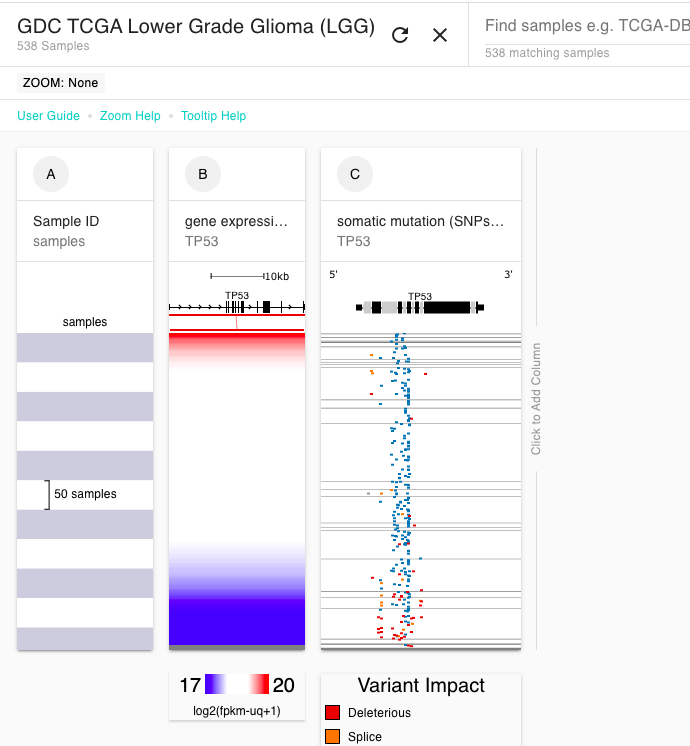
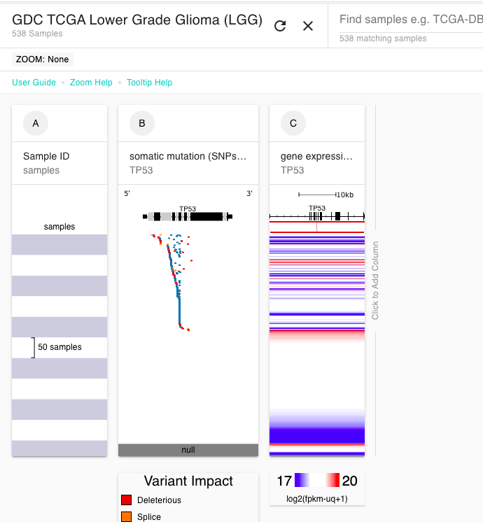

# Basic Tutorial: Section 1

## Description

This tutorial is intended for those who have never used Xena before. We will cover how to create your first Visual Spreadsheet with gene expression, mutation, and copy number variation data.

## Prerequisites

This tutorial assumes a basic understanding of 

* cancer processes that can lead to altered gene expression, such as copy number variation or mutations
* the meaning of the values in gene expression, mutation, and copy number variation data
* the goals of the the Cancer Genome Atlas \(TCGA\)

These resources can help you gain a basic understanding of these concepts:







## Estimated time needed

**Part A**: 5 min

**Part B**: 10 min

## Learning goals

**Part A**

* Create a Visual Spreadsheet
* Compare data across columns

**Part B**

* Move columns
* Resize columns
* Zoom in and out

## Tutorial

We are going to be examining _EGFR_ aberrations in lung adenocarcinomas using TCGA. We will be looking at mutation and copy number aberrations and how they affect gene expression.



### Part A

Our goal is to build a Visual Spreadsheet and understand the relationship between the columns

#### [Ending Screenshot](https://xenabrowser.net/?bookmark=6b1057b1103e9995069e3dbdd7da83ba)

#### Steps

1. Start at our home page [http://xena.ucsc.edu/](http://xena.ucsc.edu/) and click on 'Launch Xena'. You are now in our Visual Spreadsheet Wizard.
2. Type 'GDC TCGA Lung Adenocarcinoma \(LUAD\)', select this study from the drop down menu, and click 'Done'.
3. Type '_EGFR_', select the checkboxes for Gene Expression, Copy Number, and Somatic Mutation, and click 'Done'.

#### Video of steps

#### How to read a Visual Spreadsheet

Samples are on the y-axis and your columns of data are on the x-axis. We line up all columns so that each row is the same sample, allowing you to easily see trends in the data. Data is always sorted left to right and sub-sorted on columns thereafter.

#### Biological interpretation

We can see that samples that have high expression of _EGFR_ \(red, column B\) tend to either have amplifications of _EGFR_ \(red,  column C\) or mutations in _EGFR_ \(blue tick marks, column D\)


More information

* [Visual Spreadsheet](../overview-of-features/visual-spreadsheet/#after-you-made-a-visual-spreadsheet)
* [Colors and values in columns](../overview-of-features/visual-spreadsheet/#data-values)
* [Sample sorting](../overview-of-features/visual-spreadsheet/#sample-sorting)


### Part B

To further explore the relationship between the gene expression, mutation, and copy number variation data for _EGFR_, we will move columns to change the sort order, resize columns, and zoom in both for the entire Visual Spreadsheet and within a column.

#### Steps

1. **Move columns.** Click column C, copy number variation, and drag it to the left so that it becomes the first column after the samples column \(i.e. column B\). Note that the samples are now sorted by the values in this column.
2. **Resize columns.** Click the handle in the lower right corner of column D, mutation. Move it to the right to make the column bigger. 
3. **Zoom in on a column.** Click and drag within column D. Release to zoom.
4. **Zoom out on a column.** Click the red zoom out text at the top of column D.
5. **Zoom in on samples.** Click and drag vertically in any column in the Visual Spreadsheet to zoom in on these samples.
6. **Zoom out on samples.** To zoom out click either 'Zoom out' or 'Clear zoom' at the top of the Visual Spreadsheet.

#### Video of step 1

#### Video of step 2

#### Video of steps 3-6


More information

* [Visual Spreadsheet](../overview-of-features/visual-spreadsheet/)


## Test your knowledge



Create a Visual Spreadsheet looking at _TP53_ gene expression and mutation in GDC TCGA Lower Grade Glioma.



\*\*\*\*[**Ending Screenshot**](https://xenabrowser.net/?bookmark=047f1e992294275ea871bc09d4971903)\*\*\*\*






Change the Visual Spreadsheet from Question 1 so that the samples are sorted by mutations rather than gene expression.



\*\*\*\*[**Ending Screenshot**](https://xenabrowser.net/?bookmark=48a5b8fdbb425670cc1f9aad893c4a53)\*\*\*\*




