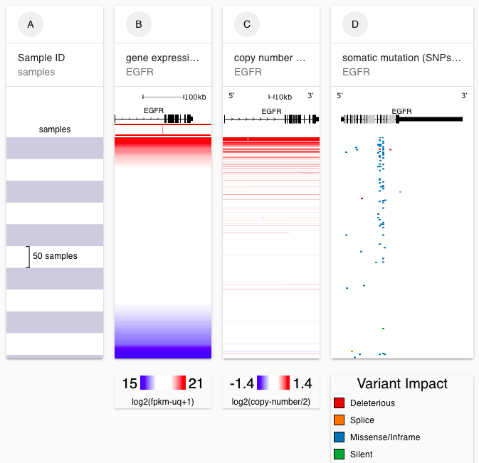
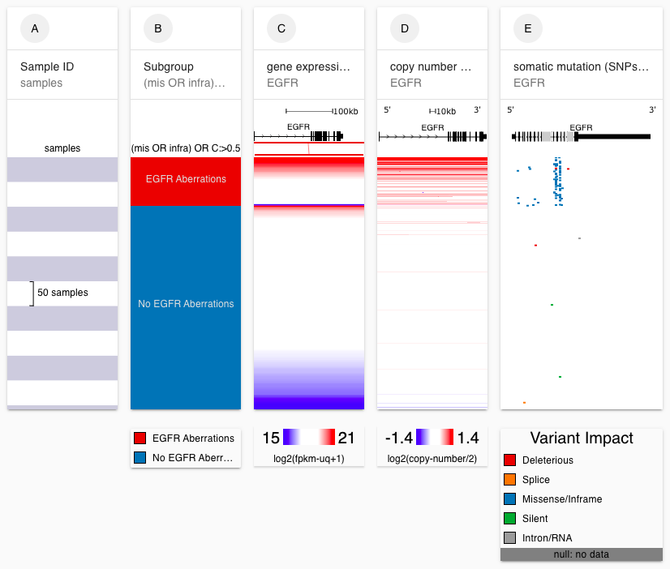
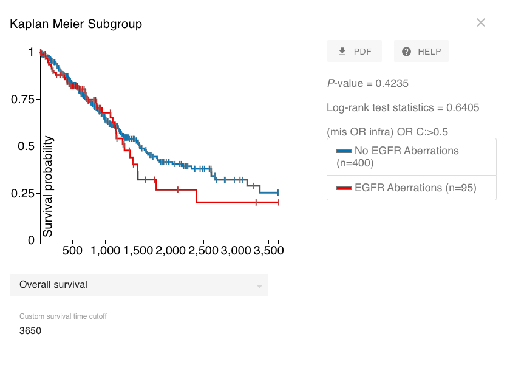
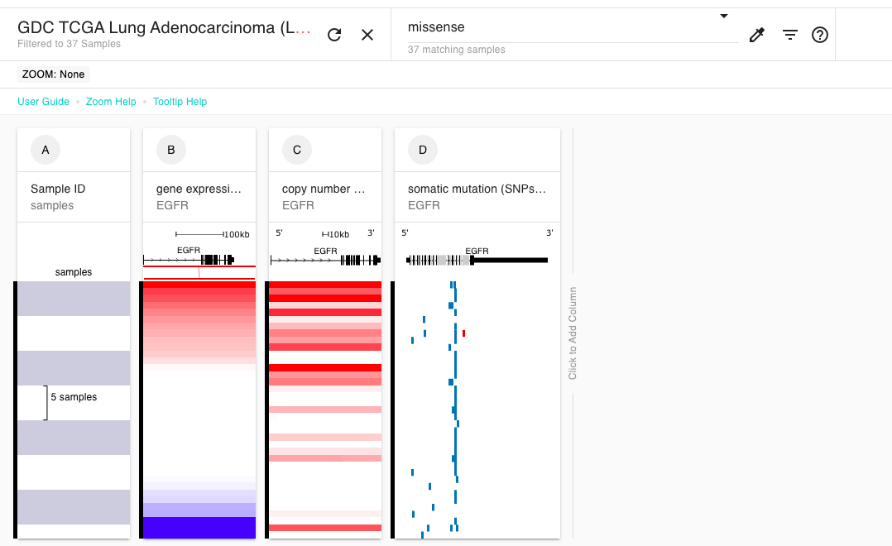
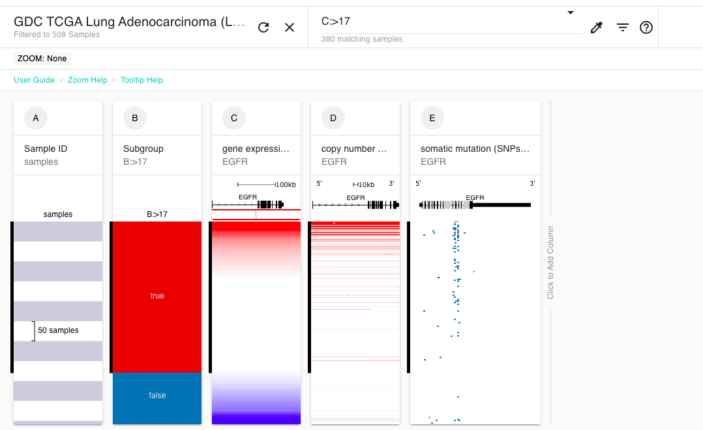
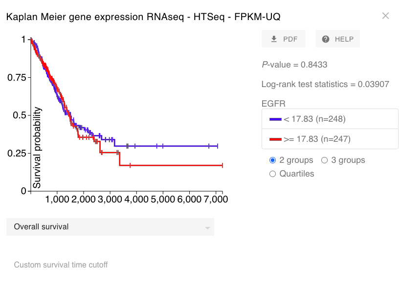

# Basic Tutorial: Section 2

## Description

This tutorial is intended for those who have never used Xena before but who have completed Section 1 of the Basic Tutorial. We will cover how to filter to just the samples you are interested in, how to create subgroups, and how to run a Kaplan Meier survival analysis.

## Prerequisites

This tutorial assumes completion of the [Basic Tutorial: Section 1](basic-tutorial-section-1.md). This tutorial begins where the Basic Tutorial: Section 1 ends.

## Estimated time needed

**Part A**: 15 min

**Part B**: 15 min

**Part C:** 5 min

## Learning goals

**Part A**

* Search for samples of interest
* Filter to keep or remove those samples of interest

**Part B**

* Make subgroups
* Rename subgroups

**Part C**

* Run a Kaplan Meier survival analysis
* Use a custom time endpoint

## Tutorial

In the Basic Tutorial Section 1 we found that we found that samples that have aberrations in _EGFR_ \(mutations or amplifications\) have higher expression.

Now we are going to investigate whether those samples with aberrations have a worse survival prognosis.


To ensure your columns are sorted the same as those in this tutorial, please start at this link: [https://xenabrowser.net/?bookmark=6b1057b1103e9995069e3dbdd7da83ba](https://xenabrowser.net/?bookmark=6b1057b1103e9995069e3dbdd7da83ba)


### Part A

Our goal is to remove samples with no data \(i.e. null\) from the view. This will make the view look cleaner and remove irrelevant samples from our Kaplan Meier survival analysis.

#### [Ending Screenshot](https://xenabrowser.net/?bookmark=1420a515a2cd26f4bf12d267a857e5f8)

#### Steps

1. Type 'null' into the samples search bar. This will highlight samples that have 'null' values in any column on the screen. Null means that there is no data for that sample for that column.
2. Click the filter menu and select 'Remove samples'.
3. Delete the search term.

#### Video of steps


**More information**

* [**Searching for and filtering samples**](../overview-of-features/filter-and-subgrouping.md)\*\*\*\*


### Part B

Our goal is to create two subgroups, those samples with aberrations in _EGFR_ and those samples without aberrations in _EGFR_. We will then name the subgroups.

#### [Ending Screenshot](https://xenabrowser.net/?bookmark=38be4e92f265543aa88f058bd618945d)

#### Steps

1. Type **'**\(mis OR infra\) OR C:&gt;0.5'  into the samples search bar. This will select samples that either have a missense or inframe deletion '\(mis OR infra\)', or where copy number variation \(column C\) is greater than 0.5. Note that I arbitrarily choose a cutoff of 0.5.
2. Click the filter menu and select 'New column subgroup'. This will create a new column that has samples that met our search term marked as 'true' \(ie. those that have an _EGFR_ aberration\) and those that did not meet our search term as 'false' \(ie. those that do not have an _EGFR_ aberration\).
3. Click the column menu and chose 'Display'.
4. Rename the display so that samples that are 'true' are instead labeled as 'EGFR Aberrations' and the samples that are 'false' are instead labeled as 'No EGFR Aberrations'. Click 'Done'
5. Delete the search term. This will remove the black tick marks for matching samples.


**More information**

* [**Searching for and filtering samples**](../overview-of-features/filter-and-subgrouping.md)\*\*\*\*


#### Video of steps 1-2

#### Video of steps 2-5

### Part C

Now that we have our subgroups we will run a Kaplan Meier survival analysis. Note that TCGA survival data is in days, hence the x-axis will be in days.


**More information**

* \*\*\*\*[**Kaplan Meier survival analysis**](../overview-of-features/kaplan-meier-plots.md)\*\*\*\*


#### [Ending Screenshot](https://xenabrowser.net/?bookmark=9e55264b9bd8b70efea1fc680a3bbf39)

#### Steps

1. Click the column menu at the top of column B.
2. Choose 'Kaplan Meier Plot'.
3. Click 'Custom survival time cutoff' at the bottom of the Kaplan Meier plot.
4. Enter 3650, as this is 10 years.

#### Video of steps

## Test your knowledge



Starting at the end of Part A, filter down to only those samples that have a missense mutation.



Search term: "missense"

\*\*\*\*[**Ending screenshot**](https://xenabrowser.net/?bookmark=52eb484ac43599d8e06737f92982e735)\*\*\*\*

[https://xenabrowser.net/?bookmark=52eb484ac43599d8e06737f92982e735](https://xenabrowser.net/?bookmark=52eb484ac43599d8e06737f92982e735)





Starting at the end of Part A, create two subgroups: those with _EGFR_ expression greater than 17 and those with _EGFR_ expression less than 17.



Search term: "B:&gt;17"

\*\*\*\*[**Ending screenshot**](https://xenabrowser.net/?bookmark=bc3a2db67aaf68ba269948505c10c6a6)\*\*\*\*

[https://xenabrowser.net/?bookmark=bc3a2db67aaf68ba269948505c10c6a6](https://xenabrowser.net/?bookmark=bc3a2db67aaf68ba269948505c10c6a6)





Starting at the end of Part A, run a Kaplan Meier analysis on _EGFR_ expression column.



**Ending screenshot**

[https://xenabrowser.net/?bookmark=fdd47d50c1c538d8112aabc24d540132](https://xenabrowser.net/?bookmark=fdd47d50c1c538d8112aabc24d540132)



