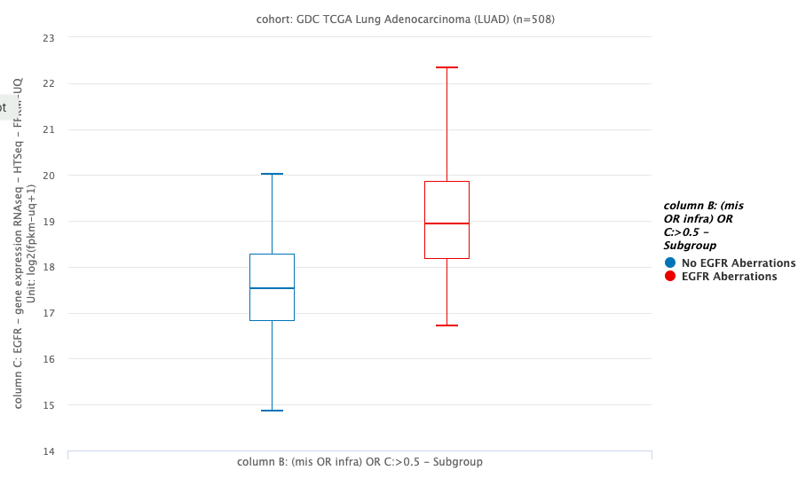
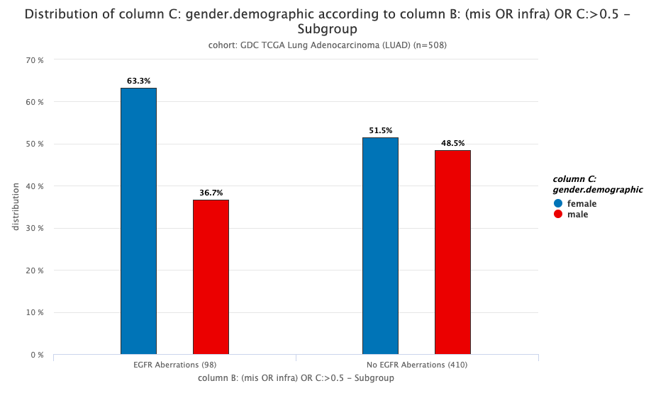
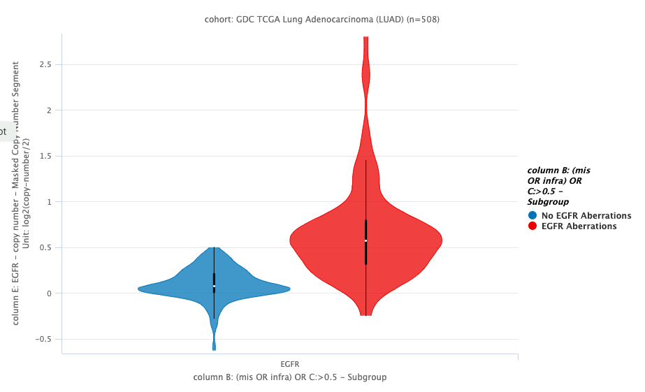
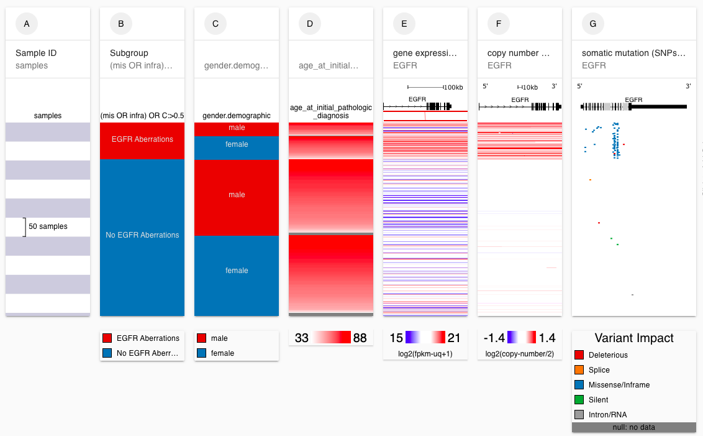

# Basic Tutorial: Section 3

## Description

This tutorial is intended for those who have never used Xena before but who have completed Section 1 of the Basic Tutorial \(completion of Section 2 is recommended but not required\). We will cover how to make box plots and bar charts using our Charts and Statistics View and how to add another column of data, in particular phenotype data, to the view.

## Prerequisites

This tutorial assumes completion of the [Basic Tutorial: Section 1](basic-tutorial-section-1.md). Completion of [Basic Tutorial: Section 2](basic-tutorial-section-2.md) is recommended but not required. This tutorial begins where the Basic Tutorial: Section 2 ends. A live link to the end of Basic Tutorial: Section 2 is provided at the beginning of this tutorial.

## Estimated time needed

**Part A**: 5 min

**Part B**: 15 min

## Learning goals

**Part A**

* Create a box plot using the Charts and Statistics View

**Part B**

* Add another column of data to the view
* Add phenotype data to the view
* Create a bar chart using the Charts and Statistics View

## Tutorial

In the Basic Tutorial: Section 1 we found that we found that samples that have aberrations in _EGFR_ \(mutations or amplifications\) have higher expression.

In the Basic Tutorial: Section 2 we created two subgroups: those with aberrations and those without aberrations in _EGFR_. We ran a Kaplan Meier survival analysis and found that there was no survival difference between these two groups. 

Now we are going to use the subgroups created in the Basic Tutorial: Section 2 to see if there is a statistical difference in expression between the two subgroups and whether males or females have more aberrations.


To ensure your columns are sorted the same as those in this tutorial, please start at this link: [https://xenabrowser.net/?bookmark=2862e84d66d5c2e1a99a44fd4e2c4045](https://xenabrowser.net/?bookmark=2862e84d66d5c2e1a99a44fd4e2c4045)


### Part A

We found that samples that have aberrations in _EGFR_ \(mutations or amplifications\) have higher expression. Now we are going to investigate if this difference in expression statistically significant.

#### [Ending Screenshot](https://xenabrowser.net/?bookmark=dc05bbdcf590f7df4506fbcd721f60b5)

#### Steps

1. Click the graph icon in the upper right corner to enter Chart View.
2. Click 'Compare subgroups', since we want to compare the group of samples who have aberrations in _EGFR_ to the group of samples that do not.
3. Click the dropdown for 'Show data from' and choose 'column C: EGFR - gene expression RNAseq - HTSeq - FPKM-UQ'.
4. Click the dropdown for 'Subgroup samples by' and choose 'column B: \(mis OR infra\) OR C:&gt;0.5 - Subgroup'.
5. Click 'Done'. 

#### Video of steps

### Part B

We will now investigate how _EGFR_ aberrations compare between men and women. 

#### [Ending Screenshot](https://xenabrowser.net/?bookmark=6b1057b1103e9995069e3dbdd7da83ba)

**Steps**

1. Click the 'x' in the upper right corner to exit Chart View.
2. Hover between columns B and C until 'Click to insert a column' becomes visible. Click on it.
3. Choose 'Phenotypic'
4. Type 'gender' into the search bar.
5. Select 'gender.demographic' from the dropdown menu.
6. Click 'Done'.
7. Click the column menu at the top of column C and choose 'Chart & Statistics'. Note that this is just another way to enter Chart View.
8. Click 'Compare subgroups', since we want to compare the group of samples who have aberrations in _EGFR_ to the group of samples that do not.
9. 'column C: gender.demographic' should already be selected for  'Show data from'. If not, select it.
10. 'column B: \(mis OR infra\) OR C:&gt;0.5 - Subgroup' should already be selected for 'Subgroup samples by'. If not, select it.
11. Click 'Done'. 

#### Video of steps 1-6

#### Video of steps 7-11

## Test your knowledge



Starting at the end of Part A, create a violin plot that compares copy number variation between samples that have _EGFR_ aberrations and those that do not.



**Ending Screenshot**

[https://xenabrowser.net/?bookmark=07b189f18423721b05c23fe4a1f0b0aa](https://xenabrowser.net/?bookmark=07b189f18423721b05c23fe4a1f0b0aa)





Starting at the end of Part B, add the phenotype data 'age\_at\_initial\_pathologic\_diagnosis' to the plot.



**Ending Screenshot**

Note that your column order may be different.

[https://xenabrowser.net/?bookmark=e3a364e74e74a9dbeb7f23b8c286456e](https://xenabrowser.net/?bookmark=e3a364e74e74a9dbeb7f23b8c286456e)



