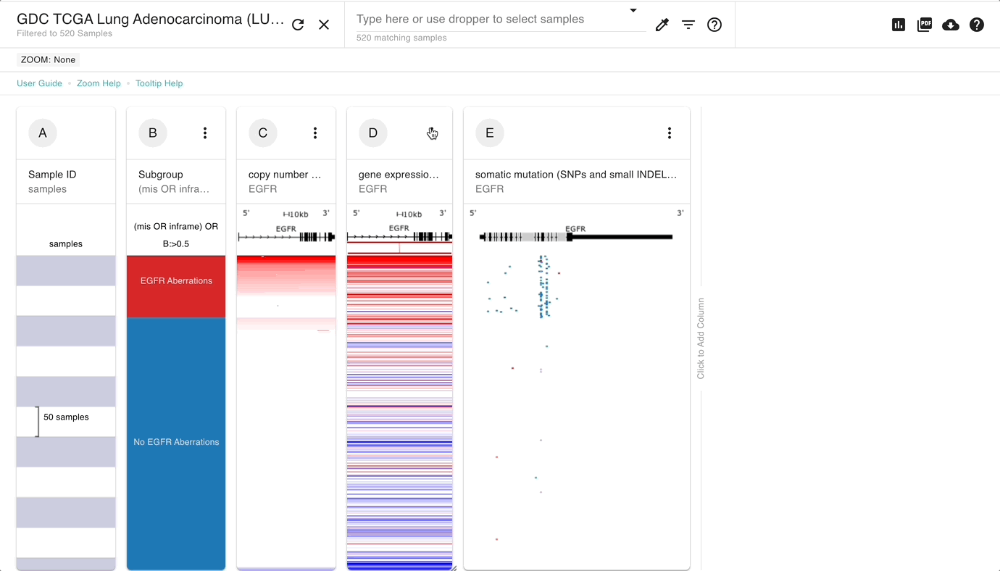
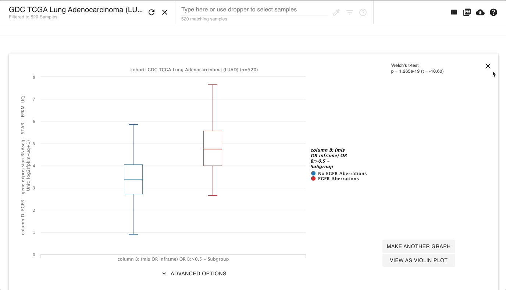
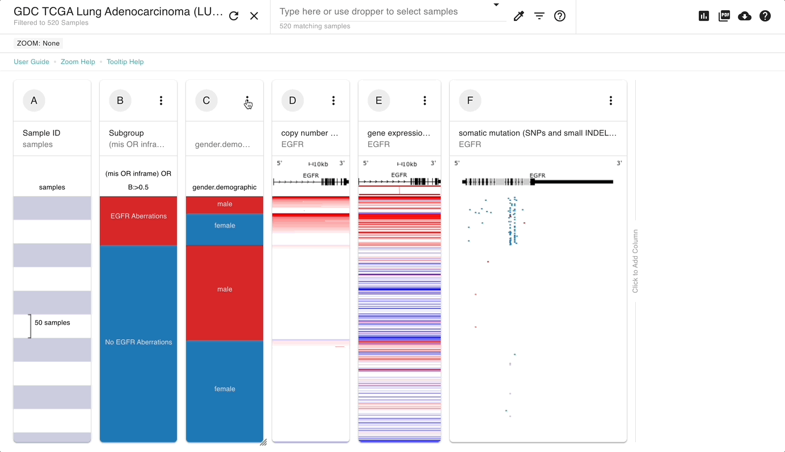

# Basic Tutorial: Section 3

## Description

This tutorial is made for those who have never used Xena but who have completed Section 1 of the Basic Tutorial. We will cover how to make box plots and bar charts using our Charts and Statistics View and how to add another column of data, in particular phenotype data, to the view.

## Prerequisites

This tutorial assumes you have done [Basic Tutorial: Section 1](basic-tutorial-section-1.md). [Basic Tutorial: Section 2](basic-tutorial-section-2.md) is recommended but not required. This tutorial begins where the Basic Tutorial: Section 2 ends. A live link to the end of Basic Tutorial: Section 2 is at the beginning of this tutorial.

## Estimated time needed

**Part A**: 5 min

**Part B**: 15 min

## Learning goals

**Part A**

* Create a box plot using the Charts and Statistics View

**Part B**

* Add another column of data to the view
* Add phenotype data to the view
* Create a bar chart using the Charts and Statistics View

## Tutorial

In the [Basic Tutorial: Section 1](basic-tutorial-section-1.md) we found that patient's samples that have aberrations in EGFR have higher expression. These aberrations could be mutations or copy number amplifications.&#x20;

In the [Basic Tutorial: Section 2](basic-tutorial-section-2.md) we created two subgroups: patient's samples that have aberrations in _EGFR_ and those without. We ran a Kaplan Meier survival analysis and found that there was no difference in survival between these two groups.&#x20;

Now we are going to use the subgroups created in the [Basic Tutorial: Section 2](basic-tutorial-section-2.md) to see if there is a statistical difference in gene expression between the two subgroups. We will also look at whether samples from male or female patients have more aberrations.


To ensure your columns are sorted the same as those in this tutorial, [please start at this link](https://xenabrowser.net/?bookmark=466a1efdac90d411d979c2f576c6845c).


### Part A

We found that patient's samples that have aberrations in _EGFR_ have higher gene expression. Now we are going to investigate if this difference in gene expression statistically significant.

#### [Ending Screenshot](https://xenabrowser.net/?bookmark=b18df76113c70e72297e87c6d0b9de2f)

<figure><figcaption></figcaption></figure>

We can now see that patient's samples with _EGFR_ aberrations have statistically higher gene expression.

#### Steps

1. Click the 3-dot column menu at the top of the gene expression column (don't worry if you start with another column - you will be selecting the correct columns in the steps ahead).
2. Click 'Compare subgroups', since we want to compare the group of samples who have aberrations in _EGFR_ to the group of samples that do not.
3. Click the dropdown for 'Show data from' and choose 'column C: EGFR - gene expression RNAseq - HTSeq - FPKM-UQ'.
4. Click the dropdown for 'Subgroup samples by' and choose 'column B: (mis OR infra) OR C:>0.5 - Subgroup'.
5. Click 'Done'.&#x20;

#### Video of steps

<figure><figcaption></figcaption></figure>


More information

* [Chart and Statistics View](../overview-of-features/chart-view.md)


### Part B

We will now investigate how _EGFR_ aberrations compare between samples from men and women.

#### [Ending Screenshot](https://xenabrowser.net/?bookmark=00dfb92a2515e87ab0397ea71a7ffe7d)

<figure><figcaption></figcaption></figure>

We can now see that _EGFR_ aberrations are more common in samples from females.

**Steps**

1. Click the 'x' in the upper right corner to exit Chart View.
2. Hover between columns B and C until 'Click to insert a column' becomes visible. Click on it.
3. Choose 'Phenotypic', click in the search bar, and choose 'Advanced'.
4. Type 'gender' into the search bar, select 'gender.demographic' from the dropdown menu, and click 'Done'.
5. Click the column menu at the top of column C and choose 'Chart & Statistics'. Note that this is just another way to enter Chart View.
6. Click 'Compare subgroups', since we want to compare the group of samples who have aberrations in _EGFR_ to the group of samples that do not.
7. 'column C: gender.demographic' should already be selected for  'Show data from'. If not, select it.
8. 'column B: (mis OR infra) OR C:>0.5 - Subgroup' should already be selected for 'Subgroup samples by'. If not, select it.
9. Click 'Done'.&#x20;

#### Video of steps 1-4

<figure><figcaption></figcaption></figure>

#### Video of steps 5-9

<figure><figcaption></figcaption></figure>


More information

* [Chart and Statistics View](../overview-of-features/chart-view.md)


## Test your knowledge



Starting at the end of Part A, create a violin plot that compares copy number variation between patient's samples that have _EGFR_ aberrations and those that do not.



[**Ending Screenshot**](https://xenabrowser.net/?bookmark=bfa684729ba0574bb6338bff698135c0)

<figure><figcaption></figcaption></figure>





Starting at the end of Part B, add the phenotype data 'age\_at\_earliest\_diagnosis\_in\_years.diagnoses.xena\_derived' to the plot.



[**Ending Screenshot**](https://xenabrowser.net/?bookmark=5b2da5f5d3056beb6b20ab4e3e4ce7af)

<figure><figcaption></figcaption></figure>


Note that your column order may be different.



