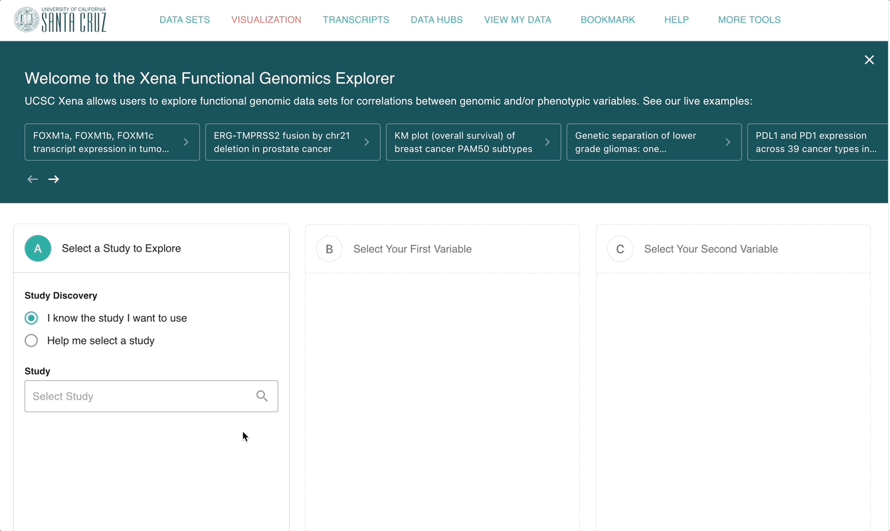
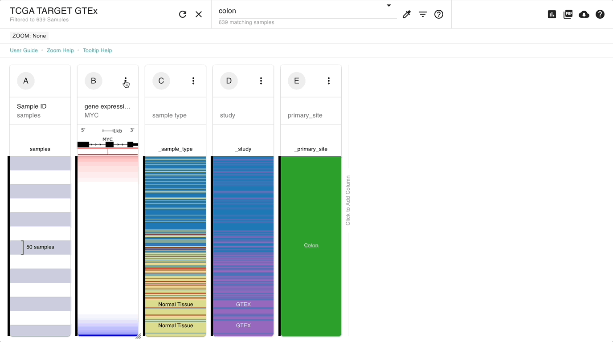

# Tutorial: Tumor vs Normal

## Description

This tutorial is made for those who have basic knowledge of how to use Xena. We will cover how to view tumor and normal samples from healthy and diseased individuals together, and how to compare gene expression for one or more genes between tumor and normal samples.&#x20;

We will be using both GTEx samples as our normal samples as well as TCGA matched normal samples. More information on GTEx normal samples can be found here:


[tumor-vs-normal.md](../how-do-i/tumor-vs-normal.md)


## Prerequisites

This tutorial assumes basic knowledge of how to build and read a [Visual Spreadsheet](../overview-of-features/visual-spreadsheet/). To get this, go through [Basic Tutorial: Section 1](basic-tutorial-section-1.md).

## Estimated time needed

**Part A**: 10 min

**Part B**: 5 min

## Learning goals

**Part A**

* Build a visual spreadsheet with the columns primary site, sample type, study, and gene expression for the TCGA TARGET GTEx study.
* Filter to just colon samples.

**Part B**

* Create a box plot using the Charts and Statistics View

## Tutorial

We will compare _MYC_ gene expression between patient's samples in TCGA colon adenocarcinoma tumor samples and individuals normal colon tissue in GTEx.

### Part A

Our goal is to build a visual spreadsheet with the columns 'primary site', 'sample site', 'study', and gene expression for _MYC_ for the TCGA TARGET GTEx study. We will then filter to samples in the colon.

#### [Ending Screenshot](https://xenabrowser.net/?bookmark=1bd621010a99958b139840a83a49562d)

We can now see that normal samples tend to have lower _MYC_ gene expression.

#### Steps

1. Start at our home page [http://xena.ucsc.edu/](http://xena.ucsc.edu/) and click on 'Launch Xena'. You are now in our Visual Spreadsheet Wizard.
2. Type 'TCGA TARGET GTEx', select this study from the drop down menu, and click 'To first variable'.
3. Type '_MYC_', select the checkbox for Gene Expression and click 'To second variable'.
4. Choose 'Phenotypic' and select the checkboxes for 'sample type', 'study' and 'Primary site', and click 'Done'.
5. Type 'colon' in the samples search bar and choose 'Keep samples'.

#### Video of steps 1-4

<figure><figcaption></figcaption></figure>

#### Video of step 5

### Part B

Our goal is to see if the difference in gene expression, where normal samples tend to have lower _MYC_ gene expression, is statistically significant.

#### [Ending Screenshot](https://xenabrowser.net/?bookmark=5037e150565a8331ca94d869dfb0a209)

We can now see that patient's tumor samples, both recurrent, primary, and metastatic, have higher expression compared to normal tissue, both patient's matched normal tissue from TCGA and unmatched individual's normal tissue from GTEx.

#### Steps

1. Click the column menu for column B (_MYC_ gene expression) and choose 'Charts & Stats'
2. Click 'Compare subgroups', click the dropdown for 'Show data from' and choose 'column B: MYC - gene expression RNAseq - RSEM norm\_count' if it is not already selected
3. Click the dropdown for 'Subgroup samples by' and choose 'column C: Sample Type'.
4. Leave the chart type as 'box plot', and click 'Done'.&#x20;

#### Video of steps 1-4

<figure><figcaption></figcaption></figure>

## Test your knowledge



Compare _EGFR_ gene expression between patient's tumor samples and individual's normal lung tissue.



[**Ending Screenshot**](https://xenabrowser.net/?bookmark=6b6103b8e6dab4eb31d2008891b59814)



