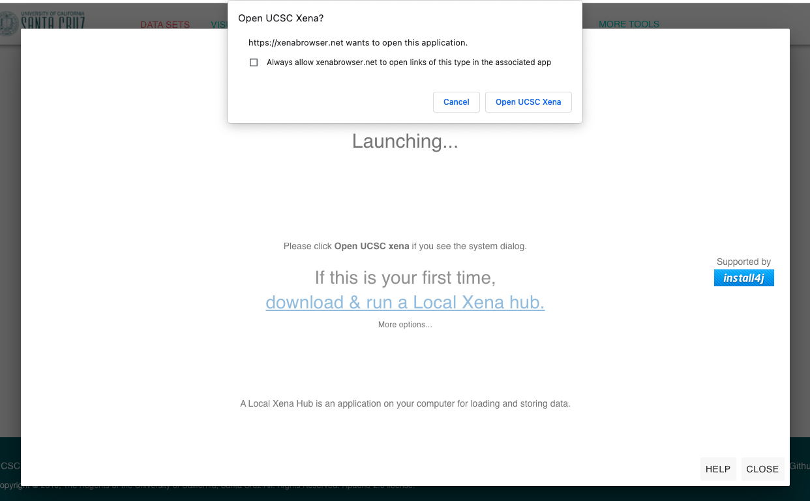
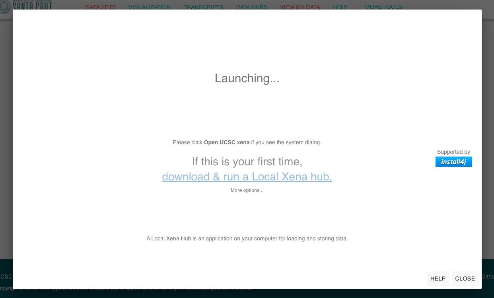
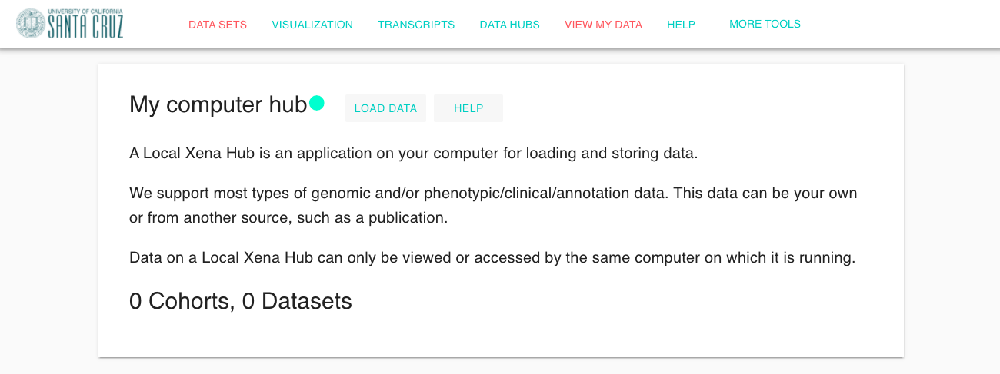
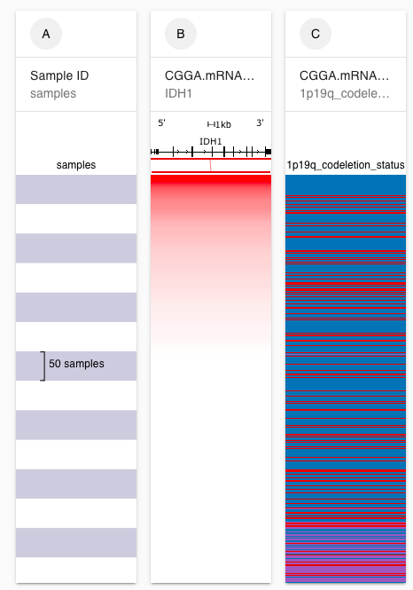
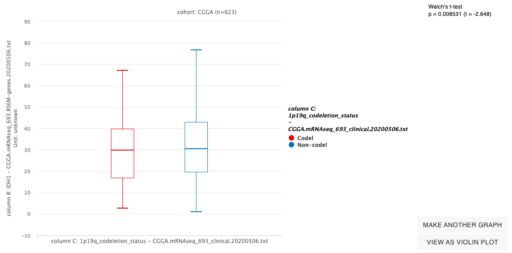
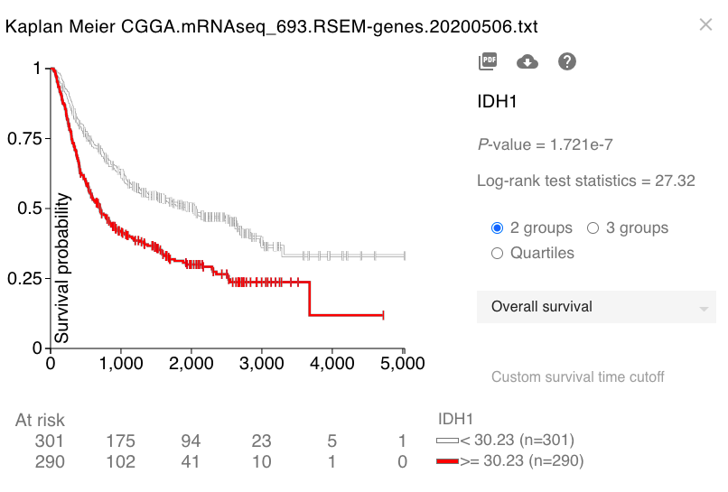

# Tutorial: Viewing your own data

## Description

This tutorial is intended for those who have a basic understanding of how to use Xena. We will cover how to load your own data into a Xena hub on your computer and view the data in the Xena Browser

We will be viewing RNAseq and clinical data from the Chinese Glioma Genome Atlas \(CGGA\).



## Prerequisites

To format the datasets you will need access to a spreadsheet application, such as Microsoft Excel.

To load the data into a Local Xena Hub you will need a computer over which you have installation privileges. 

To visualize the data, you will need a basic understanding of how to build and read a [Visual Spreadsheet](../overview-of-features/visual-spreadsheet/), how to [filter samples](../overview-of-features/filter-and-subgrouping/), how to [create a box plot in Chart View](../overview-of-features/chart-view.md), and how to [run a Kaplan Meier Analysis](../overview-of-features/kaplan-meier-plots.md). This can be achieved through completion of the Basic Tutorials, starting with [Basic Tutorial: Section 1](basic-tutorial-section-1.md).

## Estimated time needed

**Part A**: 10 min

**Part B:** 15 min

**Part C**: 10 min

## Learning goals

**Part A**

* Download data from CGGA
* Use Microsoft Excel or another spreadsheet application to make a minor formatting adjustment to enable Kaplan Meier analyses

**Part B**

* Download and install a Local Xena Hub
* Load data into the Xena Hub on your computer

**Part C**

* Make a visual spreadsheet from the data in the Xena Hub on your computer
* Create a box plot
* Run a Kaplan Meier Analysis

## Tutorial

### Part A

First we will start with the files downloaded from this study. These files already conform to our data file requirements, namely that they are matrices that have sample IDs along one axis and probe, gene, or clinical data names along the other. The files are tab-delimited \(we accept both tab-delimited and Microsoft Excel files\). 

For more information see:



While we can load the files exactly as is, we will perform a minor manipulation so that we can create a Kaplan Meier plot using the clinical data. Our Kaplan Meier analyses need two columns of clinical data to create a plot: the event/censor column and the time to that event/censor.  These columns need to be specially named so that our Kaplan Meier analysis recognizes them. In this case, for Overall Survival, the column names need to be 'OS' and 'OS.time'. 

For more information on other supported column headers for our Kaplan Meier analysis see:



\*\*\*\*[**Genomic and Clinical data to load into Xena**](https://drive.google.com/file/d/1iiu0yM-XHV2KVHW1ixIMLSvHvTAkXF5l/view)\*\*\*\*

#### Steps to format the file

1. Go to [http://www.cgga.org.cn/download.jsp](http://www.cgga.org.cn/download.jsp) and scroll to the DataSet ID mRNAseq\_693.
2. Click to download the 'Clinical Data' and 'Expression Data from STAR+RSEM'. Unzip the files. The resulting files should be named 'CGGA.mRNAseq\_693.RSEM-genes.20200506.txt' and 'CGGA.mRNAseq\_693\_clinical.20200506.txt'.
3. Open CGGA.mRNAseq\_693\_clinical.20200506.txt

    in a spreadsheet application like Microsoft Excel. If the spreadsheet application asks, these files are tab-delimited.

4. Rename the column header 'OS' to be 'OS.time'.
5. Rename the column header 'Censor \(alive=0; dead=1\)' to be 'OS'.
6. Save and close the file.


There is no need to open CGGA.mRNAseq\_693.RSEM-genes.20200506.txt since it is ready to be loaded into the Local Xena Hub on your computer as is.



\*\*\*\*[**Genomic and Clinical data to load into Xena** ](https://drive.google.com/file/d/1iiu0yM-XHV2KVHW1ixIMLSvHvTAkXF5l/view)\*\*\*\*


### Part B

#### **Steps**

#### **If this is your first time viewing your own data**

1. Click '[VIEW MY DATA](https://xenabrowser.net/datapages/?addHub=http%3A%2F%2F127.0.0.1%3A7222&host=http%3A%2F%2F127.0.0.1%3A7222)' at the top of the screen. You should see a screen similar to this \(details will vary with your browser and operating system\):

2. Click 'Open UCSC Xena' to set your computer up to automatically open the Xena Hub when you come to this page in the future. 

3. Click on 'download & run a Local Xena Hub' to download the correct installer for your computer.

4. Double-click the installer to install the Xena Hub on your computer. Follow onscreen instructions, which vary by operating system. 

Please reference our [FAQ/Troubleshooting Guide](../local-xena-hub/faq-troubleshooting-guide.md) or [contact us](../contact-us.md) if you encounter any problems.

#### **If you already have viewed your own data**

1. Click '[VIEW MY DATA](https://xenabrowser.net/datapages/?addHub=http%3A%2F%2F127.0.0.1%3A7222&host=http%3A%2F%2F127.0.0.1%3A7222)' at the top of the screen. You should see a screen similar to this \(details will vary with your browser and operating system\):

2. Wait for 30 seconds. If you allowed your browser to open the Xena Hub every time you come to this screen, then it will open the Xena Hub and this dialog box will close. If you did not, you will need to go to your Applications Folder and open UCSC Xena yourself

Whether you have viewed your own data before or not, you should arrive at a screen like this:


If you have already loaded data previously, you may see datasets and cohorts listed at the bottom of the screen


#### Steps to load the data files

1. Click the 'Load Data' button.
2. Click 'Select Data File', choose 'CGGA.mRNAseq\_693\_**clinical.**20200506.txt', and click 'Next'.
3. Choose 'Phenotypic Data' and click 'Next'.
4. Choose 'The first column is sample IDs' and click 'Next'
5. Choose 'These are the first data on these samples.', change the study name to 'CGGA', and click 'Import'.
6. Choose 'Load more data'
7. Click 'Select Data File', choose 

   'CGGA.mRNAseq\_693.**RSEM-genes**.20200506.txt', and click 'Next'.

8. Choose 'Genomic Data' and click 'Next'.
9. Confirm selection of 'The first row is sample IDs' and click 'Next'
10. Choose 'I have loaded other data on these samples and want to connect to it.', select 'CGGA' from the drop down, and click 'Import'.

#### Video of steps 1-6

#### Video of steps 7-10


Note that it can take up to several minutes for the RNAseq data to load since it is relatively large.


### Part C

We will look at 1p-19q co-deletion  in Chinese glioma patients and compare this to IDH1 expression.

#### Ending Screenshot for Visual Spreadsheet \(end of step 5\)

#### Ending Screenshot for Box plot \(end of step 11\)

#### Ending Screenshot for Kaplan Meier Analysis \(end of step 13\)


Note that we are unable to provide links to these ending screenshots, similar to other tutorials, due to the fact that we do not allow users to create bookmarks when viewing data from their own Local Xena Hubs. This is to protect the privacy of your data. [For more information see our Bookmarks help section.](../overview-of-features/bookmarks.md)


#### Steps

1. Click on 'Visualization' in the top menu bar.
2. Close the Welcome banner at the top of the screen to make the wizard bigger.
3. Choose 'CGGA' as the study and click 'Done'.
4. Enter the gene 'IDH1', choose 'CGGA.mRNAseq\_693.RSEM-genes.20200506.txt', and click 'Done'
5. Choose 'Phenotypic', click '1p19q\_codeletion\_status', and click 'Done'
6. The dataset authors annotated samples without a 1p/19q co-deletion status with 'NA'. To remove these samples, type 'NA' in the samples search bar and choose 'Remove Samples' from the filter actions menu drop down.
7. Compare IDH1 expression between samples with a 1p/19q co-deletion and those that do not. To do this, click on the column menu for column B \(IDH1 expression\) and choose 'Charts & Stats'.
8. Choose 'Compare Subgroups'.
9. Click the dropdown for 'Show data from' and choose 'column B: IDH1 - CGGA.mRNAseq\_693.RSEM-genes.20200506.txt'.
10. Click the dropdown for 'Subgroup samples by' and choose 'column C: 1p19q\_codeletion\_status - CGGA.mRNAseq\_693\_clinical.20200506.txt'.
11. Click 'Done'. 
12. Close the chart using the 'x' in the upper left corner.
13. Run a Kaplan Meier analysis comparing patients with high IDH1 expression to those with low IDH1 expression. To do this, click on the column menu for column B \(IDH1 expression\) and choose 'KM plot'

#### Video of steps 1-5

#### Video of steps 6-11

#### Video of steps 12-13

